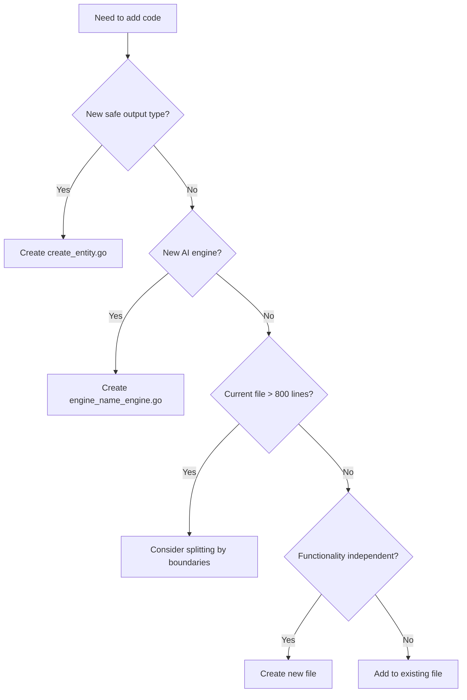
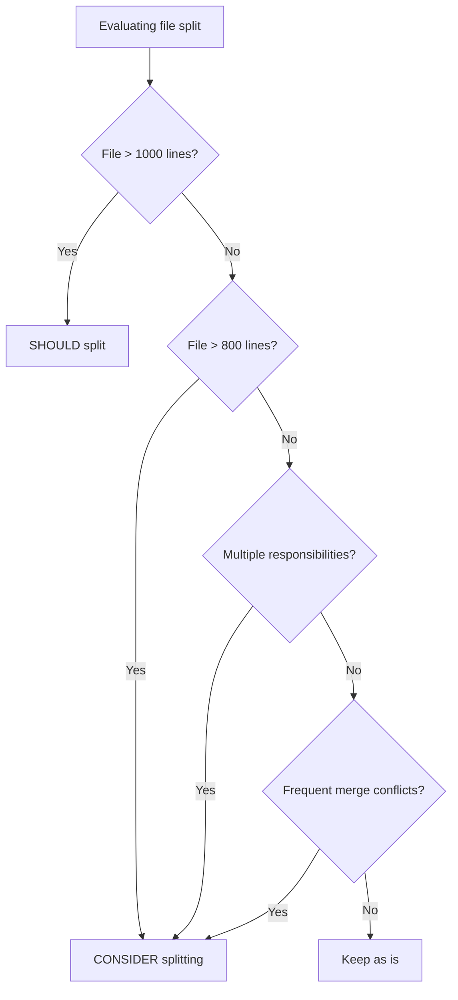
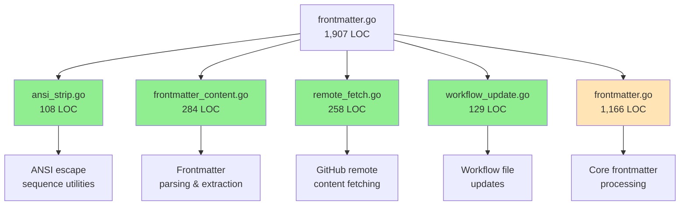
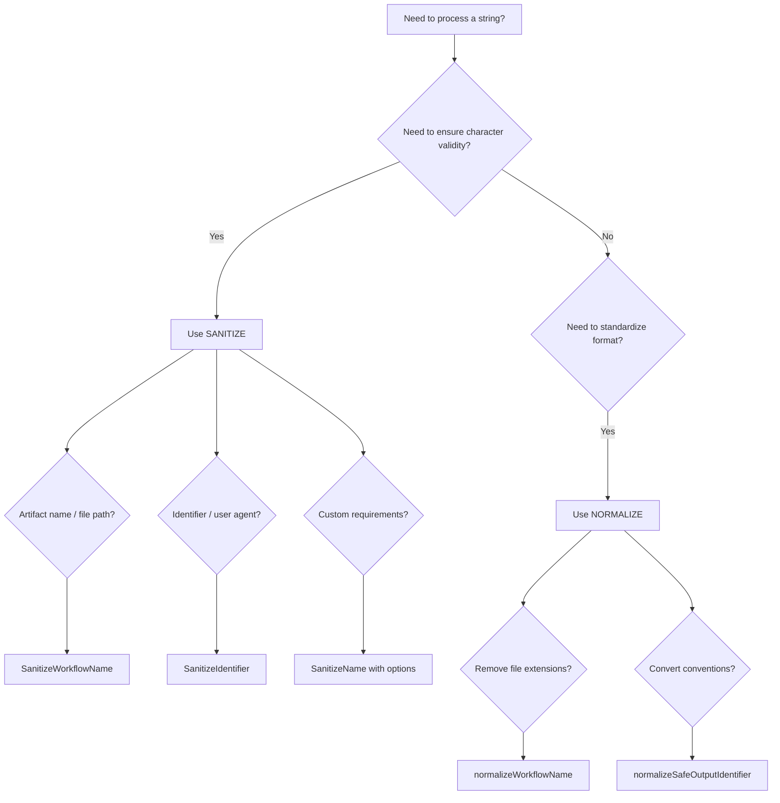

# Code Organization

Use this reference for gh-aw code organization patterns, file structure guidelines, WASM build-variant stubs, and string sanitization/normalization conventions.

## Table of Contents

- [File Organization Principles](#file-organization-principles)
- [Excellent Patterns to Follow](#excellent-patterns-to-follow)
- [File Size Guidelines](#file-size-guidelines)
- [Decision Trees](#decision-tree-creating-new-files)
- [Case Study: Refactoring Large Files](#case-study-refactoring-large-files)
- [Anti-Patterns to Avoid](#anti-patterns-to-avoid)
- [Helper File Conventions](#helper-file-conventions)
- [String Sanitization vs Normalization](#string-sanitization-vs-normalization)
- [WASM Build-Variant Pattern](#wasm-build-variant-pattern)

### File Organization Principles

The codebase follows clear patterns for organizing code by functionality rather than type. This section provides guidance on maintaining code quality and structure.

#### Prefer Many Small Files Over Large Ones

Organize code into focused files of 100-500 lines rather than creating large monolithic files.

**Example:**
```
create_issue.go (160 lines)
create_pull_request.go (238 lines)
create_discussion.go (118 lines)
```

#### Group by Functionality, Not by Type

**Recommended approach:**
```
create_issue.go            # Issue creation logic
create_issue_test.go       # Issue creation tests
add_comment.go             # Comment addition logic
add_comment_test.go        # Comment tests
```

**Avoid:**
```
models.go                  # All structs
logic.go                   # All business logic
tests.go                   # All tests
```

### Excellent Patterns to Follow

#### Create Functions Pattern

One file per GitHub entity creation operation:
- `create_issue.go` - GitHub issue creation logic
- `create_pull_request.go` - Pull request creation logic
- `create_discussion.go` - Discussion creation logic
- `create_code_scanning_alert.go` - Code scanning alert creation

Benefits:
- Clear separation of concerns
- Easy to locate specific functionality
- Prevents files from becoming too large
- Facilitates parallel development

#### Engine Separation Pattern

Each AI engine has its own file with shared helpers in `engine_helpers.go`:
- `copilot_engine.go` - GitHub Copilot engine
- `claude_engine.go` - Claude engine
- `codex_engine.go` - Codex engine
- `custom_engine.go` - Custom engine support
- `engine_helpers.go` - Shared engine utilities

#### Test Organization Pattern

Tests live alongside implementation files:
- Feature tests: `feature.go` + `feature_test.go`
- Integration tests: `feature_integration_test.go`
- Specific scenario tests: `feature_scenario_test.go`

### File Size Guidelines

| Category | Lines | Use Case | Example |
|----------|-------|----------|---------|
| Small files | 50-200 | Utilities, simple features | `args.go` (65 lines) |
| Medium files | 200-500 | Most feature implementations | `create_issue.go` (160 lines) |
| Large files | 500-800 | Complex features | `permissions.go` (905 lines) |
| Very large files | 800+ | Core infrastructure only | `compiler.go` (1596 lines) |

### Decision Tree: Creating New Files



### Decision Tree: Splitting Files



### Case Study: Refactoring Large Files

The refactoring of `pkg/parser/frontmatter.go` demonstrates applying file organization principles to a large monolithic file.

#### Initial State
- **Original file**: 1,907 lines (monolithic structure)
- **Problem**: Difficult to navigate, understand, and maintain
- **Goal**: Split into focused, maintainable modules

#### Refactoring Approach



#### Results

| Metric | Before | After | Change |
|--------|--------|-------|--------|
| Main file size | 1,907 LOC | 1,166 LOC | -741 LOC (-39%) |
| Number of files | 1 | 5 | +4 files |
| Average file size | 1,907 LOC | 233 LOC | -88% |
| Test pass rate | 100% | 100% | No change ✓ |
| Breaking changes | N/A | 0 | None ✓ |

#### Modules Extracted

1. **ansi_strip.go** (108 LOC)
   - ANSI escape sequence stripping utilities
   - Standalone, no dependencies
   - Functions: `StripANSI()`, `isFinalCSIChar()`, `isCSIParameterChar()`

2. **frontmatter_content.go** (284 LOC)
   - Basic frontmatter parsing and extraction
   - Pure functions without side effects
   - Functions: `ExtractFrontmatterFromContent()`, `ExtractFrontmatterString()`, `ExtractMarkdownContent()`, etc.

3. **remote_fetch.go** (258 LOC)
   - GitHub remote content fetching
   - GitHub API interactions and caching
   - Functions: `downloadIncludeFromWorkflowSpec()`, `resolveRefToSHA()`, `downloadFileFromGitHub()`

4. **workflow_update.go** (129 LOC)
   - High-level workflow file updates
   - Frontmatter manipulation and cron expression handling
   - Functions: `UpdateWorkflowFrontmatter()`, `EnsureToolsSection()`, `QuoteCronExpressions()`

#### Key Principles Applied

- **Single Responsibility**: Each module handles one aspect of frontmatter processing
- **Clear Boundaries**: Well-defined interfaces between modules
- **Progressive Refactoring**: Extract standalone utilities first, then higher-level modules
- **No Breaking Changes**: Maintain public API compatibility throughout
- **Test-Driven Safety**: Run tests after each extraction

#### Remaining Work

Three complex modules remain in the original file (requiring future work):
- **tool_sections.go** (~420 LOC): Tool configuration extraction and merging
- **include_expander.go** (~430 LOC): Recursive include resolution with cycle detection
- **frontmatter_imports.go** (~360 LOC): BFS import traversal and processing

These remain due to high interdependency, stateful logic, and complex recursive algorithms.

### Anti-Patterns to Avoid

#### God Files
Single file doing everything - split by responsibility instead. The frontmatter.go refactoring demonstrates how a 1,907-line "god file" can be systematically broken down.

#### Vague Naming
Avoid non-descriptive file names like `utils.go`, `helpers.go`, `misc.go`, `common.go`.

Use specific names like `ansi_strip.go`, `remote_fetch.go`, or `workflow_update.go` that clearly indicate their purpose.

#### Mixed Concerns
Keep files focused on one domain. Don't mix unrelated functionality in one file.

#### Test Pollution
Split tests by scenario rather than having one massive test file.

#### Premature Abstraction
Wait until you have 2-3 use cases before extracting common patterns.

### Helper File Conventions

Helper files contain shared utility functions used across multiple modules. Follow these guidelines when creating or modifying helper files.

#### When to Create Helper Files

Create a helper file when you have:
1. **Shared utilities** used by 3+ files in the same domain
2. **Clear domain focus** (e.g., configuration parsing, MCP rendering, CLI wrapping)
3. **Stable functionality** that won't change frequently

**Examples of Good Helper Files:**
- `github_cli.go` - GitHub CLI wrapping functions (ExecGH, ExecGHWithOutput)
- `config_helpers.go` - Safe output configuration parsing (parseLabelsFromConfig, parseTitlePrefixFromConfig)
- `map_helpers.go` - Generic map/type utilities (parseIntValue, filterMapKeys)
- `mcp_renderer.go` - MCP configuration rendering (RenderGitHubMCPDockerConfig, RenderJSONMCPConfig)

#### Naming Conventions

Helper file names should be **specific and descriptive**, not generic:

**Good Names:**
- `github_cli.go` - Indicates GitHub CLI helpers
- `mcp_renderer.go` - Indicates MCP rendering helpers
- `config_helpers.go` - Indicates configuration parsing helpers

**Avoid:**
- `helpers.go` - Too generic
- `utils.go` - Too vague
- `misc.go` - Indicates poor organization
- `common.go` - Doesn't specify domain

#### What Belongs in Helper Files

**Include:**
- Small (< 50 lines) utility functions used by multiple files
- Domain-specific parsing/validation functions
- Wrapper functions that simplify common operations
- Type conversion utilities

**Exclude:**
- Complex business logic (belongs in domain-specific files)
- Functions used by only 1-2 callers (co-locate with callers)
- Large functions (> 100 lines) - consider dedicated files
- Multiple unrelated domains in one file

#### Helper File Organization

**Current Helper Files in pkg/workflow:**

| File | Purpose | Functions | Usage |
|------|---------|-----------|-------|
| `github_cli.go` | GitHub CLI wrapper | 2 functions | Used by CLI commands and workflow resolution |
| `config_helpers.go` | Safe output config parsing | 5 functions | Used by safe output processors |
| `map_helpers.go` | Generic map/type utilities | 2 functions | Used across workflow compilation |
| `prompt_step_helper.go` | Prompt step generation | 1 function | Used by prompt generators |
| `mcp_renderer.go` | MCP config rendering | Multiple rendering functions | Used by all AI engines |
| `engine_helpers.go` | Shared engine utilities | Agent, npm install helpers | Used by Copilot, Claude, Codex engines |

#### When NOT to Create Helper Files

Avoid creating helper files when:
1. **Single caller** - Co-locate with the caller instead
2. **Tight coupling** - Function is tightly coupled to one module
3. **Frequent changes** - Helper files should be stable
4. **Mixed concerns** - Multiple unrelated utilities (split into focused files)

**Example of co-location preference:**
```go
// Instead of: helpers.go containing formatStepName() used only by compiler.go
// Do: Put formatStepName() directly in compiler.go
```

#### Refactoring Guidelines

When refactoring helper files:
1. **Group by domain** - MCP rendering → mcp_renderer.go, not engine_helpers.go
2. **Keep functions small** - Large helpers (> 100 lines) may need dedicated files
3. **Document usage** - Add comments explaining when to use each helper
4. **Check call sites** - Ensure 3+ callers before keeping in helper file

#### Example: MCP Function Reorganization

The MCP rendering functions were moved from `engine_helpers.go` to `mcp_renderer.go` because:
- **Domain focus**: All functions relate to MCP configuration rendering
- **Multiple callers**: Used by Claude, Copilot, Codex, and Custom engines
- **Cohesive**: Functions work together to render MCP configs
- **Stable**: Rendering patterns don't change frequently

**Before:**
```
engine_helpers.go (478 lines)
  - Agent helpers
  - npm install helpers
  - MCP rendering functions ← Should be in mcp_renderer.go
```

**After:**
```
engine_helpers.go (213 lines)
  - Agent helpers
  - npm install helpers
  
mcp_renderer.go (523 lines)
  - MCP rendering functions
  - MCP configuration types
```

### String Sanitization vs Normalization

The codebase uses two distinct patterns for string processing with different purposes.

#### Sanitize Pattern: Character Validity

**Purpose**: Remove or replace invalid characters to create valid identifiers, file names, or artifact names.

**When to use**: When you need to ensure a string contains only valid characters for a specific context (identifiers, YAML artifact names, filesystem paths).

**What it does**:
- Removes special characters that are invalid in the target context
- Replaces separators (colons, slashes, spaces) with hyphens
- Converts to lowercase for consistency
- May preserve certain characters (dots, underscores) based on configuration

#### Normalize Pattern: Format Standardization

**Purpose**: Standardize format by removing extensions, converting between conventions, or applying consistent formatting rules.

**When to use**: When you need to convert between different representations of the same logical entity (e.g., file extensions, naming conventions).

**What it does**:
- Removes file extensions (.md, .lock.yml)
- Converts between naming conventions (dashes to underscores)
- Standardizes identifiers to a canonical form
- Does NOT validate character validity (assumes input is already valid)

#### Function Reference

**Sanitize Functions**:
- `SanitizeName(name string, opts *SanitizeOptions) string` - Configurable sanitization with custom character preservation
- `SanitizeWorkflowName(name string) string` - Sanitizes workflow names for artifact names and file paths
- `SanitizeIdentifier(name string) string` - Creates clean identifiers for user agent strings

**Normalize Functions**:
- `normalizeWorkflowName(name string) string` - Removes file extensions to get base workflow identifier
- `normalizeSafeOutputIdentifier(identifier string) string` - Converts dashes to underscores for safe output identifiers

#### Decision Tree



#### Best Practices

1. **Choose the right tool**: Use sanitize for character validity, normalize for format standardization.
2. **Don't double-process**: If normalize produces a valid identifier, don't sanitize it again.
3. **Document intent**: When using these functions, add comments explaining which pattern you're using and why.
4. **Validate assumptions**: If you assume input is already valid, document that assumption.
5. **Consider defaults**: Use `SanitizeIdentifier` when you need a fallback default value for empty results.

#### Anti-Patterns

**Don't sanitize already-normalized strings**:
```go
// BAD: Sanitizing a normalized workflow name
normalized := normalizeWorkflowName("weekly-research.md")
sanitized := SanitizeWorkflowName(normalized) // Unnecessary!
```

**Don't normalize for character validity**:
```go
// BAD: Using normalize for invalid characters
userInput := "My Workflow: Test/Build"
normalized := normalizeWorkflowName(userInput) // Wrong tool!
// normalized = "My Workflow: Test/Build" (unchanged - invalid chars remain)
```


### WASM Build-Variant Pattern

Seven files in `pkg/workflow/` provide stub implementations of OS-dependent
features for the WASM compilation target (`GOOS=js GOARCH=wasm`) used by the
gh-aw web playground. Each file is named with the `_wasm.go` suffix (Go's
implicit filename build constraint for `GOARCH=wasm`) **and** carries an
explicit `//go:build js || wasm` tag at line 1:

```
pkg/workflow/dependabot_wasm.go
pkg/workflow/docker_validation_wasm.go
pkg/workflow/git_helpers_wasm.go
pkg/workflow/github_cli_wasm.go
pkg/workflow/npm_validation_wasm.go
pkg/workflow/pip_validation_wasm.go
pkg/workflow/repository_features_validation_wasm.go
```

Each `_wasm.go` file mirrors the public/package-level function signatures of
its non-WASM counterpart but replaces OS calls (exec, filesystem, network)
with either no-ops or `fmt.Errorf("... not available in Wasm")` returns.

#### When a `_wasm.go` Stub is Required

Add a `_wasm.go` stub whenever you add a **new function** to an existing
`_wasm.go`-guarded file (or create a new file that calls OS-level tools at
compile/validation time). Specifically:

- Functions that call `os/exec` or run external binaries (gh, git, docker,
  npm, pip, uv, etc.)
- Functions that read from the real filesystem during compilation
- Functions that perform network I/O at validation time

Functions that **do not** need a WASM stub:
- Pure data transformations (string manipulation, YAML marshaling)
- Functions that only operate on in-memory data structures
- Functions gated behind `WithSkipValidation(true)` (already excluded at
  runtime, but still need to compile)

#### How to Add a Stub

1. Identify the non-WASM file (e.g., `github_cli.go`).
2. Open (or create) the corresponding `_wasm.go` file (e.g.,
   `github_cli_wasm.go`).
3. Ensure the build tag at line 1 is `//go:build js || wasm`.
4. Add a stub with the same signature that returns a zero value and/or an
   error:
   ```go
   func MyNewFunction(args ...string) ([]byte, error) {
       return nil, fmt.Errorf("MyNewFunction not available in Wasm")
   }
   ```
5. Verify the WASM build still compiles:
   ```bash
   GOOS=js GOARCH=wasm go build ./pkg/workflow/
   ```

#### Known Gap

`github_cli_wasm.go` currently omits stubs for `enrichGHError`,
`runGHWithSpinnerContext`, `RunGHCombinedContext`, `RunGHWithHost`, and
`SetGHHostEnv`. These are unexported helpers or thin wrappers called only
by the exported `RunGH*` family, which are already stubbed; the compiler
does not reference them directly. This is intentional — avoid adding stubs
for unexported helpers unless the WASM build breaks.


