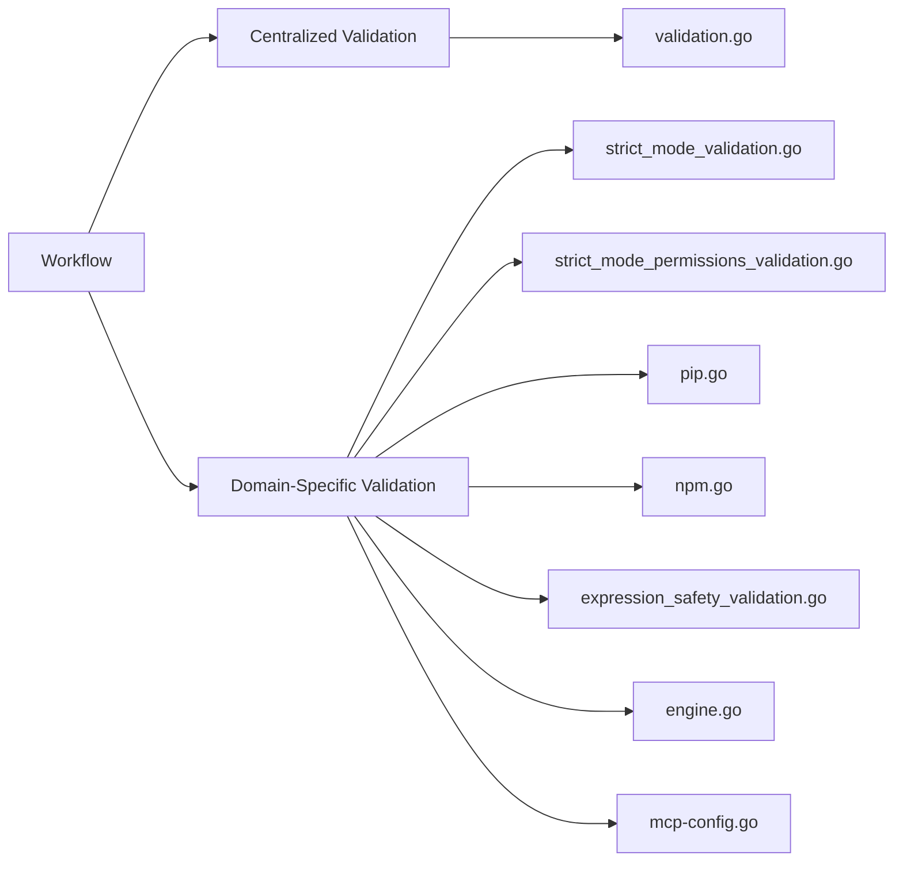
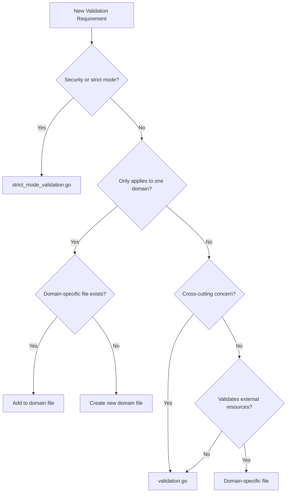
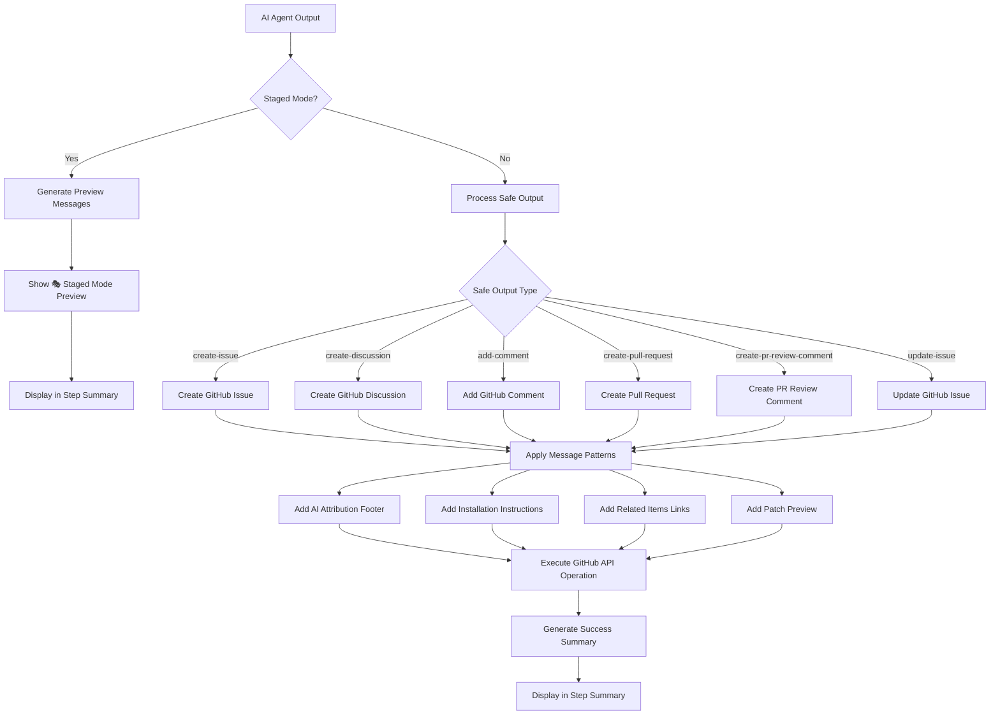
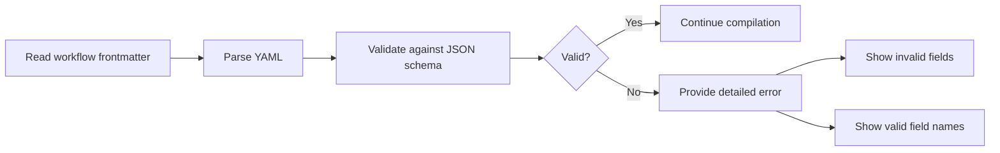
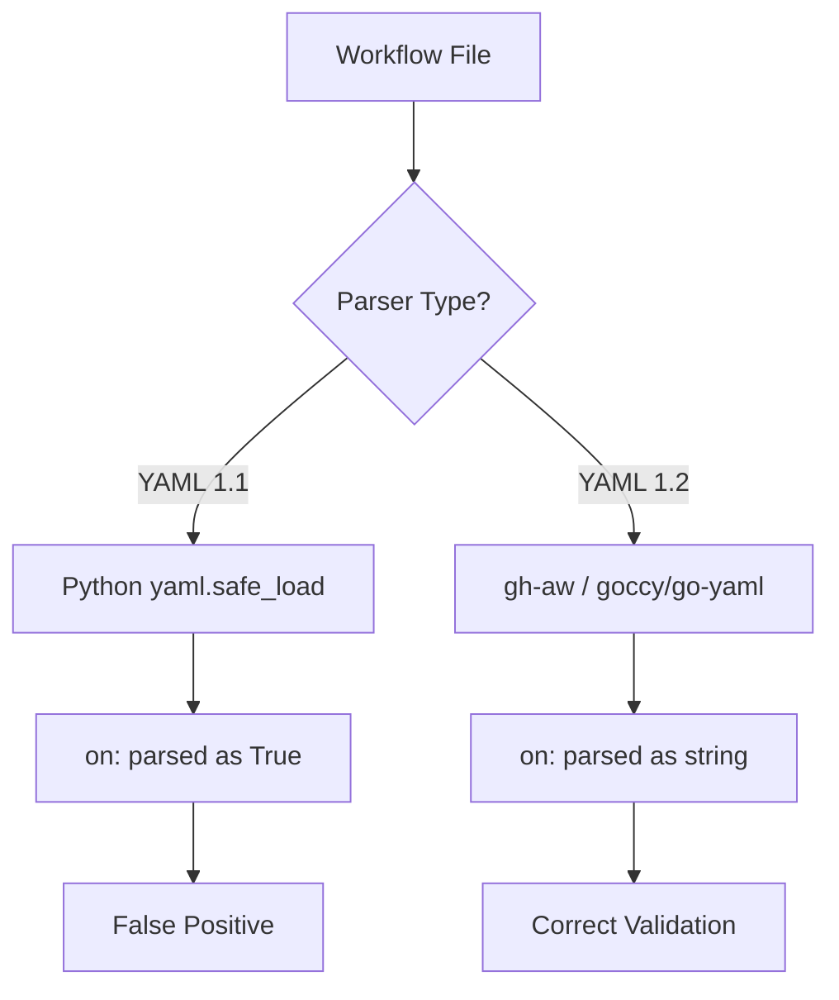
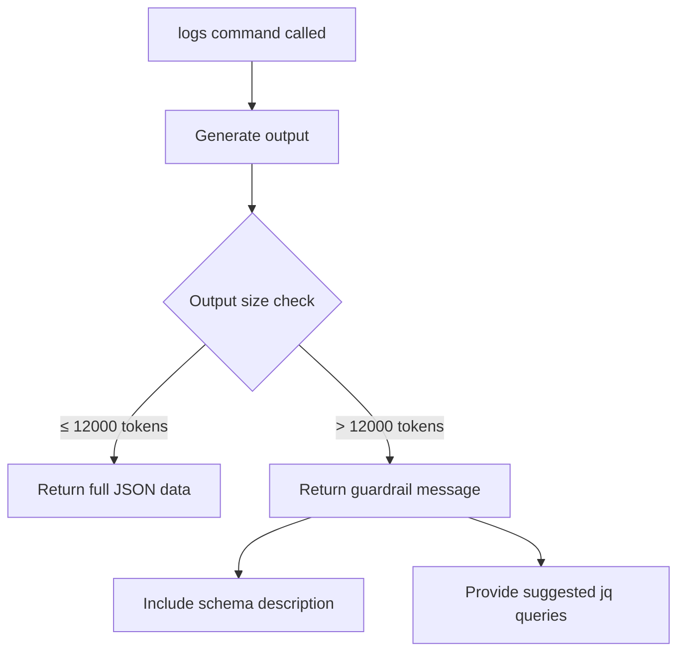

# gh-aw Internal Architecture

Use this reference when working on the gh-aw compiler internals, validation system, safe output processing, or MCP server features.

## Table of Contents

- [Validation Architecture](#validation-architecture)
- [Safe Output Messages](#safe-output-messages)
- [Schema Validation](#schema-validation)
- [YAML Compatibility](#yaml-compatibility)
- [MCP Logs Guardrail](#mcp-logs-guardrail)

## Validation Architecture

The validation system ensures workflow configurations are correct, secure, and compatible with GitHub Actions before compilation.

### Architecture Overview



### Centralized Validation

**Location:** `pkg/workflow/validation.go` (core compile-time checks)

**Purpose:** General-purpose validation that applies across the entire workflow system

**Key Functions:**
- `validateExpressionSizes()` - Ensures GitHub Actions expression size limits
- `validateContainerImages()` - Verifies Docker images exist and are accessible
- `validateRuntimePackages()` - Validates runtime package dependencies
- `validateGitHubActionsSchema()` - Validates against GitHub Actions YAML schema
- `validateNoDuplicateCacheIDs()` - Ensures unique cache identifiers
- `validateSecretReferences()` - Validates secret reference syntax
- `validateRepositoryFeatures()` - Checks repository capabilities
- `validateHTTPTransportSupport()` - Validates HTTP transport configuration
- `validateWorkflowRunBranches()` - Validates workflow run branch configuration

**When to add validation here:**
- Cross-cutting concerns that span multiple domains
- Core workflow integrity checks
- GitHub Actions compatibility validation
- General schema and configuration validation
- Repository-level feature detection

### Domain-Specific Validation

Domain-specific validation is organized into separate files in `pkg/workflow/`:

#### Strict Mode Validation

**Files:** `pkg/workflow/strict_mode_validation.go` and the `strict_mode_*.go` validators

Enforces security and safety constraints in strict mode:
- `validateStrictPermissions()` - Refuses write permissions
- `validateStrictNetwork()` - Requires explicit network configuration
- `validateStrictMCPNetwork()` - Requires network config on custom MCP servers
- `validateStrictBashTools()` - Refuses bash wildcard tools

#### Python Package Validation

**File:** `pkg/workflow/pip.go`

Validates Python package availability on PyPI.

#### NPM Package Validation

**File:** `pkg/workflow/npm.go`

Validates NPX package availability on npm registry.

#### Expression Safety

**File:** `pkg/workflow/expression_safety_validation.go`

Validates GitHub Actions expression security with allowlist-based validation. The matching test coverage lives in `pkg/workflow/expression_safety_test.go`.

### Validation Decision Tree



### Validation Patterns

#### Allowlist Validation

Used for security-sensitive validation with limited set of valid options:

```go
func validateExpressionSafety(content string) error {
    matches := expressionRegex.FindAllStringSubmatch(content, -1)
    var unauthorizedExpressions []string

    for _, match := range matches {
        expression := strings.TrimSpace(match[1])
        if !isAllowed(expression) {
            unauthorizedExpressions = append(unauthorizedExpressions, expression)
        }
    }

    if len(unauthorizedExpressions) > 0 {
        return fmt.Errorf("unauthorized expressions: %v", unauthorizedExpressions)
    }
    return nil
}
```

#### External Resource Validation

Used for validating external dependencies:

```go
func validateDockerImage(image string, verbose bool) error {
    cmd := exec.Command("docker", "inspect", image)
    output, err := cmd.CombinedOutput()

    if err != nil {
        pullCmd := exec.Command("docker", "pull", image)
        if pullErr := pullCmd.Run(); pullErr != nil {
            return fmt.Errorf("docker image not found: %s", image)
        }
    }
    return nil
}
```

#### Schema Validation

Used for configuration file validation:

```go
func (c *Compiler) validateGitHubActionsSchema(yamlContent string) error {
    schema := loadGitHubActionsSchema()

    var data interface{}
    if err := yaml.Unmarshal([]byte(yamlContent), &data); err != nil {
        return err
    }

    if err := schema.Validate(data); err != nil {
        return fmt.Errorf("schema validation failed: %w", err)
    }
    return nil
}
```

#### Progressive Validation

Used for applying multiple validation checks in sequence:

```go
func (c *Compiler) validateStrictMode(frontmatter map[string]any, networkPermissions *NetworkPermissions) error {
    if !c.strictMode {
        return nil
    }

    if err := c.validateStrictPermissions(frontmatter); err != nil {
        return err
    }

    if err := c.validateStrictNetwork(networkPermissions); err != nil {
        return err
    }

    return nil
}
```


## Safe Output Messages

Safe output functions handle GitHub API write operations (creating issues, discussions, comments, PRs) from AI-generated content with consistent messaging patterns.

### Safe Output Message Flow

The following diagram illustrates how AI-generated content flows through the safe output system to GitHub API operations:



**Flow Stages:**
1. **AI Agent Output** - AI generates content for GitHub operations
2. **Staged Mode Check** - Determines if operation is in preview mode
3. **Safe Output Processing** - Routes to appropriate GitHub operation type
4. **Message Pattern Application** - Applies consistent formatting (footers, instructions, links)
5. **GitHub API Execution** - Performs the actual GitHub operation
6. **Success Summary** - Reports results in workflow step summary

### Message Categories

#### AI Attribution Footer

Identifies content as AI-generated and links to workflow run:

```markdown
> AI generated by [WorkflowName](run_url)
```

With triggering context:
```markdown
> AI generated by [WorkflowName](run_url) for #123
```

#### Workflow Installation Instructions

```markdown
>
> To add this workflow in your repository, run `gh aw add owner/repo/path@ref`. See [usage guide](https://github.github.com/gh-aw/setup/cli/).
```

#### Staged Mode Preview

All staged mode previews use consistent format with 🎭 emoji:

```markdown
## 🎭 Staged Mode: [Operation Type] Preview

The following [items] would be [action] if staged mode was disabled:
```

#### Patch Preview

Display git patches in pull request bodies with size limits:

```markdown
<details><summary>Show patch (45 lines)</summary>

\`\`\`diff
diff --git a/src/auth.js b/src/auth.js
index 1234567..abcdefg 100644
--- a/src/auth.js
+++ b/src/auth.js
@@ -10,7 +10,10 @@ export async function login(username, password) {
-    throw new Error('Login failed');
+    if (response.status === 401) {
+      throw new Error('Invalid credentials');
+    }
+    throw new Error('Login error: ' + response.statusText);
\`\`\`

</details>
```

Limits: Max 500 lines or 2000 characters (truncated with "... (truncated)" if exceeded)

### Design Principles

#### Consistency
- All AI-generated content uses same blockquote footer format
- 🎭 emoji consistently marks staged preview mode
- URL patterns match GitHub conventions
- Step summaries follow same heading and list structure

#### Clarity
- Clear distinction between preview and actual operations
- Explicit error messages with actionable guidance
- Helpful fallback instructions when operations fail
- Field labels consistently use bold text

#### Discoverability
- Installation instructions included in footers when available
- Related items automatically linked across workflow outputs
- Step summaries provide quick access to created items
- Collapsible sections keep large content manageable

#### Safety
- Labels sanitized to prevent unintended @mentions
- Patch sizes validated and truncated when needed
- Staged mode allows testing without side effects
- Graceful fallbacks when primary operations fail


## Schema Validation

All three JSON schema files enforce strict validation with `"additionalProperties": false` at the root level, preventing typos and undefined fields from silently passing validation.

### Schema Files

| File | Purpose |
|------|---------|
| `pkg/parser/schemas/main_workflow_schema.json` | Validates agentic workflow frontmatter in `.github/workflows/*.md` files |
| `pkg/parser/schemas/mcp_config_schema.json` | Validates MCP (Model Context Protocol) server configuration |

### How It Works

When `"additionalProperties": false` is set at the root level, the validator rejects any properties not explicitly defined in the schema's `properties` section. This catches common typos:

- `permisions` instead of `permissions`
- `engnie` instead of `engine`
- `toolz` instead of `tools`
- `timeout_minute` instead of `timeout-minutes`
- `runs_on` instead of `runs-on`
- `safe_outputs` instead of `safe-outputs`

### Example Validation Error

```bash
$ gh aw compile workflow-with-typo.md
✗ error: Unknown properties: toolz, engnie, permisions. Valid fields are: tools, engine, permissions, ...
```

### Validation Process



### Schema Embedded in Binary

Schemas are embedded in the Go binary using `//go:embed` directives:

```go
//go:embed schemas/main_workflow_schema.json
var mainWorkflowSchema string
```

This means:
- Schema changes require running `make build` to take effect
- Schemas are validated at runtime, not at build time
- No external JSON files need to be distributed with the binary

### Adding New Fields

When adding new fields to schemas:

1. Update the schema JSON file with the new property definition
2. Rebuild the binary with `make build`
3. Add test cases to verify the new field works
4. Update documentation if the field is user-facing


## YAML Compatibility

YAML has two major versions with incompatible boolean parsing behavior that affects workflow validation.

### The Core Issue

#### YAML 1.1 Boolean Parsing Problem

In YAML 1.1, certain plain strings are automatically converted to boolean values. The workflow trigger key `on:` can be misinterpreted as boolean `true` instead of string `"on"`.

**Example:**
```python
# Python yaml.safe_load (YAML 1.1 parser)
import yaml

content = """
on:
  issues:
    types: [opened]
"""

result = yaml.safe_load(content)
print(result)
# Output: {True: {'issues': {'types': ['opened']}}}
#          ^^^^ The key is boolean True, not string "on"!
```

This creates false positives when validating workflows with Python-based tools.

#### YAML 1.2 Correct Behavior

YAML 1.2 parsers treat `on`, `off`, `yes`, and `no` as regular strings, not booleans. Only explicit boolean literals `true` and `false` are treated as booleans.

**Example:**
```go
// Go goccy/go-yaml (YAML 1.2 parser) - Used by gh-aw
var result map[string]interface{}
yaml.Unmarshal([]byte(content), &result)

fmt.Printf("%+v\n", result)
// Output: map[on:map[issues:map[types:[opened]]]]
//         ^^^ The key is string "on" ✓
```

### How gh-aw Handles This

GitHub Agentic Workflows uses **`goccy/go-yaml` v1.18.0**, which is a **YAML 1.2 compliant parser**:

- ✅ `on:` is correctly parsed as a string key, not a boolean
- ✅ Workflow frontmatter validation works correctly
- ✅ GitHub Actions YAML is compatible (GitHub Actions also uses YAML 1.2 parsing)

### Compatibility Flow



### Affected Keywords

YAML 1.1 treats these as booleans (parsed as `true` or `false`):

**Parsed as `true`:** on, yes, y, Y, YES, Yes, ON, On
**Parsed as `false`:** off, no, n, N, NO, No, OFF, Off

YAML 1.2 treats all of the above as strings. Only these are booleans: `true`, `false`

### Recommendations

#### For Workflow Authors

1. **Use gh-aw's compiler for validation:**
   ```bash
   gh aw compile workflow.md
   ```

2. **Don't trust Python yaml.safe_load for validation** - it will give false positives for the `on:` trigger key.

3. **Use explicit booleans when you mean boolean values:**
   ```yaml
   enabled: true      # Explicit boolean
   disabled: false    # Explicit boolean

   # Avoid for boolean values:
   enabled: yes       # Might be confusing across parsers
   disabled: no       # Might be confusing across parsers
   ```

#### For Tool Developers

1. **Use YAML 1.2 parsers for gh-aw integration:**
   - Go: `github.com/goccy/go-yaml`
   - Python: `ruamel.yaml` (with YAML 1.2 mode)
   - JavaScript: `yaml` package v2+ (YAML 1.2 by default)
   - Ruby: `Psych` (YAML 1.2 by default in Ruby 2.6+)

2. **Document parser version in your tool**

3. **Consider adding compatibility mode** to switch between YAML 1.1 and 1.2 parsing


## MCP Logs Guardrail

The MCP server `logs` command includes an automatic guardrail to prevent overwhelming responses when fetching workflow logs.

### How It Works



### Normal Operation (Output ≤ Token Limit)

When output is within the token limit (default: 12000 tokens), the command returns full JSON data:

```json
{
  "summary": {
    "total_runs": 5,
    "total_duration": "2h30m",
    "total_tokens": 45000,
    "total_cost": 0.23
  },
  "runs": [...],
  "tool_usage": [...]
}
```

### Guardrail Triggered (Output > Token Limit)

When output exceeds the token limit, the command returns structured response with:

```json
{
  "message": "⚠️  Output size (15000 tokens) exceeds the limit (12000 tokens). To reduce output size, use the 'jq' parameter with one of the suggested queries below.",
  "output_tokens": 15000,
  "output_size_limit": 12000,
  "schema": { ... },
  "suggested_queries": [
    {
      "description": "Get only the summary statistics",
      "query": ".summary",
      "example": "Use jq parameter: \".summary\""
    },
    ...
  ]
}
```

### Configuring the Token Limit

Default limit is 12000 tokens (approximately 48KB of text). Customize using the `max_tokens` parameter:

```json
{
  "name": "logs",
  "arguments": {
    "count": 100,
    "max_tokens": 20000
  }
}
```

Token estimation uses approximately 4 characters per token (OpenAI's rule of thumb).

### Using the jq Parameter

Filter output using jq syntax:

**Get only summary statistics:**
```json
{ "jq": ".summary" }
```

**Get run IDs and basic info:**
```json
{ "jq": ".runs | map({database_id, workflow_name, status})" }
```

**Get only failed runs:**
```json
{ "jq": ".runs | map(select(.conclusion == \"failure\"))" }
```

**Get high token usage runs:**
```json
{ "jq": ".runs | map(select(.token_usage > 10000))" }
```

### Implementation Details

**Constants:**
- `DefaultMaxMCPLogsOutputTokens`: 12000 tokens (default limit)
- `CharsPerToken`: 4 characters per token (estimation factor)

**Files:**
- `pkg/cli/mcp_logs_guardrail.go` - Core guardrail implementation
- `pkg/cli/mcp_logs_guardrail_test.go` - Unit tests
- `pkg/cli/mcp_logs_guardrail_integration_test.go` - Integration tests
- `pkg/cli/mcp_server.go` - Integration with MCP server

### Benefits

1. Prevents overwhelming responses for AI models
2. Provides guidance with specific filters
3. Self-documenting with schema description
4. Preserves functionality with jq filtering
5. Transparent messaging about why guardrail triggered

