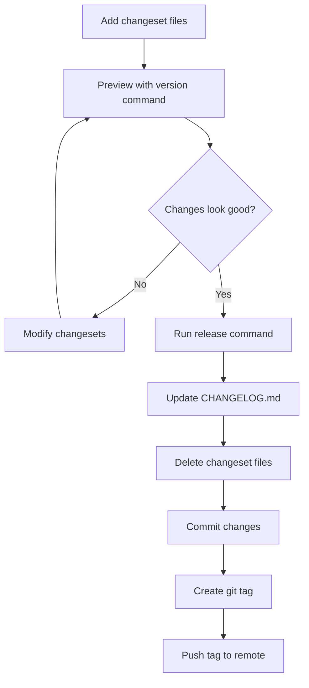
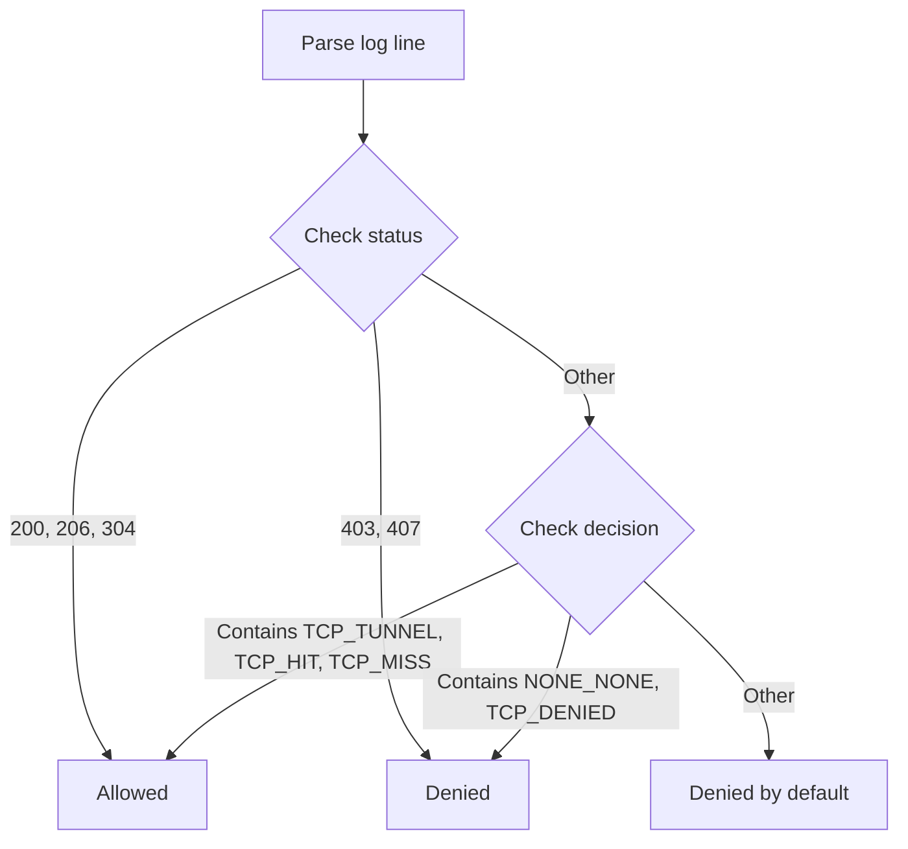
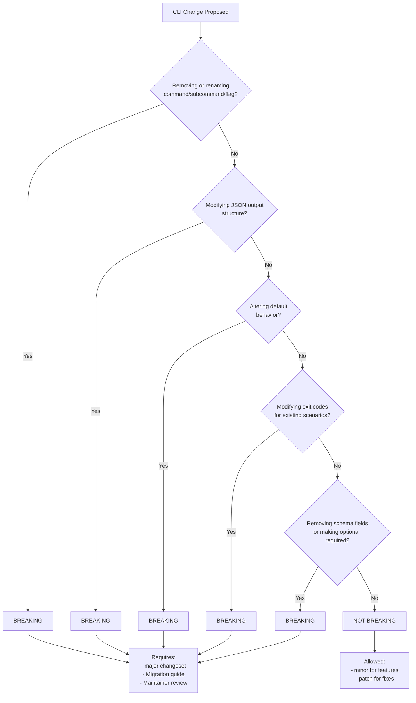
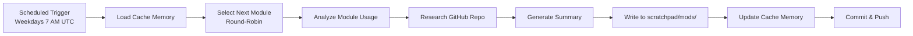

# Release and CLI Stability

Use this reference for release management procedures, understanding what constitutes a breaking CLI change, firewall log parsing, and Go module summaries.

## Table of Contents

- [Release Management](#release-management)
- [Firewall Log Parsing](#firewall-log-parsing)
- [Breaking CLI Rules](#breaking-cli-rules)
- [Go Module Summaries](#go-module-summaries)

## Release Management

The project uses a minimalistic changeset-based release system inspired by `@changesets/cli`.

### Commands

#### version (Preview Only)

The `version` command operates in preview mode and never modifies files:

```bash
node scripts/changeset.js version
# Or
make version
```

This command:
- Reads all changeset files from `.changeset/` directory
- Determines the appropriate version bump (major > minor > patch)
- Shows a preview of the CHANGELOG entry
- Never modifies any files

#### release [type] [--yes|-y]

The `release` command creates an actual release:

```bash
node scripts/changeset.js release
# Or (recommended - runs tests first)
make release
```

This command:
- Checks prerequisites (clean tree, main branch)
- Updates `CHANGELOG.md` with new version and changes
- Deletes processed changeset files (if any exist)
- Automatically commits the changes
- Creates and pushes a git tag for the release

**Flags:**
- `--yes` or `-y`: Skip confirmation prompt

### Release Workflow



### Changeset File Format

Changeset files are markdown files in `.changeset/` directory with YAML frontmatter:

```markdown
"gh-aw": patch

Brief description of the change
```

**Bump types:**
- `patch` - Bug fixes and minor changes (0.0.x)
- `minor` - New features, backward compatible (0.x.0)
- `major` - Breaking changes (x.0.0)

### Prerequisites for Release

When running `release`, the script checks:

1. **Clean working tree:** All changes must be committed or stashed
2. **On main branch:** Must be on the `main` branch to create a release

### Releasing Without Changesets

For maintenance releases with dependency updates:

```bash
# Defaults to patch release
node scripts/changeset.js release

# Or specify release type explicitly
node scripts/changeset.js release minor

# Skip confirmation
node scripts/changeset.js release --yes
```

The script will:
- Default to patch release if no type specified
- Add a generic "Maintenance release" entry to CHANGELOG.md
- Commit the changes
- Create a git tag
- Push the tag to remote


## Firewall Log Parsing

The firewall log parser provides analysis of network traffic logs from agentic workflow runs.

### Log Format

Firewall logs use space-separated format with 10 fields:

```
timestamp client_ip:port domain dest_ip:port proto method status decision url user_agent
```

**Example:**
```
1761332530.474 172.30.0.20:35288 api.enterprise.githubcopilot.com:443 140.82.112.22:443 1.1 CONNECT 200 TCP_TUNNEL:HIER_DIRECT api.enterprise.githubcopilot.com:443 "-"
```

### Field Descriptions

1. **timestamp** - Unix timestamp with decimal (e.g., "1761332530.474")
2. **client_ip:port** - Client IP and port or "-"
3. **domain** - Target domain:port or "-"
4. **dest_ip:port** - Destination IP and port or "-"
5. **proto** - Protocol version (e.g., "1.1") or "-"
6. **method** - HTTP method (e.g., "CONNECT", "GET") or "-"
7. **status** - HTTP status code (e.g., "200", "403") or "0"
8. **decision** - Proxy decision (e.g., "TCP_TUNNEL:HIER_DIRECT") or "-"
9. **url** - Request URL or "-"
10. **user_agent** - User agent string (quoted) or "-"

### Request Classification



**Allowed Indicators:**
- Status codes: 200, 206, 304
- Decisions containing: TCP_TUNNEL, TCP_HIT, TCP_MISS

**Denied Indicators:**
- Status codes: 403, 407
- Decisions containing: NONE_NONE, TCP_DENIED

**Default:** Denied (for safety when classification is ambiguous)

### Output Examples

#### Console Output

```
🔥 Firewall Log Analysis
Total Requests   : 8
Allowed Requests : 5
Denied Requests  : 3

Allowed Domains:
  ✓ api.enterprise.githubcopilot.com:443 (1 requests)
  ✓ api.github.com:443 (2 requests)

Blocked Domains:
  ✗ blocked-domain.example.com:443 (2 requests)
```

#### JSON Output

```json
{
  "firewall_log": {
    "total_requests": 8,
    "allowed_requests": 5,
    "blocked_requests": 3,
    "allowed_domains": [
      "api.enterprise.githubcopilot.com:443",
      "api.github.com:443"
    ],
    "blocked_domains": [
      "blocked-domain.example.com:443"
    ],
    "requests_by_domain": {
      "api.github.com:443": {
        "allowed": 2,
        "blocked": 0
      }
    }
  }
}
```

### Integration Points

The `logs` and `audit` commands automatically:
1. Search for firewall logs in run directories
2. Parse all `.log` files in `firewall-logs/` or `squid-logs/` directories
3. Aggregate statistics across all log files
4. Include firewall analysis in console and JSON output
5. Cache results in `run_summary.json`

### Implementation

**Files:**
- `pkg/cli/firewall_log.go` (396 lines) - Core parser implementation
- `pkg/cli/firewall_log_test.go` (437 lines) - Unit tests
- `pkg/cli/firewall_log_integration_test.go` (238 lines) - Integration tests

**Testing:**
```bash
# Unit tests
make test-unit

# Integration tests
go test ./pkg/cli -run TestFirewallLogIntegration
```


## Breaking CLI Rules

This section defines what constitutes a breaking change for the gh-aw CLI. These rules help maintainers and contributors evaluate changes during code review and ensure stability for users.

### Overview

Breaking changes require special attention during development and review because they can disrupt existing user workflows. This section provides clear criteria for identifying breaking changes and guidance on how to handle them.

### Categories of Changes

#### Breaking Changes (Major Version Bump)

The following changes are **always breaking** and require:
- A `major` changeset type
- Documentation in CHANGELOG.md with migration guidance
- Review by maintainers

**1. Command Removal or Renaming**

Breaking:
- Removing a command entirely (e.g., removing `gh aw logs`)
- Renaming a command without an alias (e.g., `gh aw compile` → `gh aw build`)
- Removing a subcommand (e.g., removing `gh aw mcp inspect`)

Examples from past releases:
- Removing `--no-instructions` flag from compile command (v0.17.0)

**2. Flag Removal or Renaming**

Breaking:
- Removing a flag (e.g., removing `--strict` flag)
- Changing a flag name without backward compatibility (e.g., `--output` → `--out`)
- Changing a flag's short form (e.g., `-o` → `-f`)
- Changing a required flag to have no default when it previously had one

Examples from past releases:
- Remove GITHUB_TOKEN fallback for Copilot operations (v0.24.0)

**3. Output Format Changes**

Breaking:
- Changing the structure of JSON output (removing fields, renaming fields)
- Changing the order of columns in table output that users might parse positionally
- Changing exit codes for specific scenarios
- Removing output fields that scripts may depend on

Examples from past releases:
- Update status command JSON output structure (v0.21.0): replaced `agent` with `engine_id`, removed `frontmatter` and `prompt` fields

**4. Behavior Changes**

Breaking:
- Changing default values for flags (e.g., `strict: false` → `strict: true`)
- Changing authentication requirements
- Changing permission requirements
- Changing the semantics of existing options

Examples from past releases:
- Change strict mode default from false to true (v0.31.0)
- Remove per-tool Squid proxy - unify network filtering (v0.25.0)

**5. Schema Changes**

Breaking:
- Removing fields from workflow frontmatter schema
- Making optional fields required
- Changing the type of a field (e.g., string → object)
- Removing allowed values from enums

Examples from past releases:
- Remove "defaults" section from main JSON schema (v0.24.0)
- Remove deprecated "claude" top-level field (v0.24.0)

#### Non-Breaking Changes (Minor or Patch Version Bump)

The following changes are **not breaking** and typically require:
- A `minor` changeset for new features
- A `patch` changeset for bug fixes

**1. Additions**

Not Breaking:
- Adding new commands
- Adding new flags with reasonable defaults
- Adding new fields to JSON output
- Adding new optional fields to schema
- Adding new allowed values to enums
- Adding new exit codes for new scenarios

Examples:
- Add `--json` flag to status command (v0.20.0)
- Add mcp-server command (v0.17.0)

**2. Deprecations**

Not Breaking (when handled correctly):
- Deprecating commands (with warning, keeping functionality)
- Deprecating flags (with warning, keeping functionality)
- Deprecating schema fields (with warning, keeping functionality)

Requirements for deprecation:
- Print deprecation warning to stderr
- Document the deprecation and migration path
- Keep deprecated functionality working for at least one minor release
- Schedule removal in a future major version

**3. Bug Fixes**

Not Breaking (when fixing unintended behavior):
- Fixing incorrect output
- Fixing incorrect exit codes
- Fixing schema validation that was too permissive

Note: Fixing a bug that users depend on may require a breaking change notice.

**4. Performance Improvements**

Not Breaking:
- Faster execution
- Reduced memory usage
- Parallel processing optimizations

**5. Documentation Changes**

Not Breaking:
- Improving help text
- Adding examples
- Clarifying error messages

### Decision Tree: Is This Breaking?



### Guidelines for Contributors

**When Making CLI Changes:**

1. Check the decision tree before implementing changes
2. Document breaking changes clearly in the changeset
3. Provide migration guidance for users affected by breaking changes
4. Consider backward compatibility - can you add an alias instead of renaming?
5. Use deprecation warnings for at least one minor release before removal

**Changeset Format for Breaking Changes:**

```markdown
"gh-aw": major

Remove deprecated `--old-flag` option

**⚠️ Breaking Change**: The `--old-flag` option has been removed.

**Migration guide:**
- If you used `--old-flag value`, use `--new-flag value` instead
- Scripts using this flag will need to be updated

**Reason**: The option was deprecated in v0.X.0 and has been removed to simplify the CLI.
```

**Changeset Format for Non-Breaking Changes:**

For new features:
```markdown
"gh-aw": minor

Add --json flag to logs command for structured output
```

For bug fixes:
```markdown
"gh-aw": patch

Fix incorrect exit code when workflow file not found
```

### Review Checklist for CLI Changes

Reviewers should verify:

- [ ] Breaking change identified correctly - Does this change match any breaking change criteria?
- [ ] Changeset type appropriate - Is it marked as major/minor/patch correctly?
- [ ] Migration guidance provided - For breaking changes, is there clear migration documentation?
- [ ] Deprecation warning added - If deprecating, does it warn users?
- [ ] Backward compatibility considered - Could this be done without breaking compatibility?
- [ ] Tests updated - Do tests cover the changed behavior?
- [ ] Help text updated - Is the CLI help accurate?

### Exit Code Standards

The CLI uses standard exit codes:

| Exit Code | Meaning | Breaking to Change |
|-----------|---------|-------------------|
| 0 | Success | No (adding is fine) |
| 1 | General error | No (for new errors) |
| 2 | Invalid usage | No (for new checks) |

Breaking: Changing the exit code for an existing scenario (e.g., changing from 1 to 2 for a specific error type).

### JSON Output Standards

When adding or modifying JSON output:

1. Never remove fields without a major version bump
2. Never rename fields without a major version bump
3. Never change field types without a major version bump
4. Adding new fields is safe - parsers should ignore unknown fields
5. Adding new enum values is safe - parsers should handle unknown values gracefully

### Strict Mode and Security Changes

Special consideration for strict mode changes:

- Making strict mode validation refuse instead of warn is breaking (e.g., v0.30.0)
- Changing strict mode defaults is breaking (e.g., v0.31.0)
- Adding new strict mode validations is not breaking (strictness is opt-in initially)

### References

- **Changeset System**: See Release Management section for version management details
- **CHANGELOG**: See `CHANGELOG.md` for examples of breaking changes
- **Semantic Versioning**: https://semver.org/


## Go Module Summaries

The `scratchpad/mods/` directory contains AI-generated summaries of Go module usage patterns in the gh-aw repository, created by the Go Fan workflow.

### Purpose

Go module summaries provide:
- **Module overview** and version information
- **Files and APIs** that use the module
- **Research findings** from the module's GitHub repository
- **Improvement opportunities** (quick wins, feature opportunities, best practices)
- **References** to documentation and changelog

### File Naming Convention

Module summary files follow a consistent naming pattern where the Go module path has slashes replaced with dashes:

| Module Path | File Name |
|-------------|-----------|
| `github.com/goccy/go-yaml` | `goccy-go-yaml.md` |
| `github.com/spf13/cobra` | `spf13-cobra.md` |
| `github.com/stretchr/testify` | `stretchr-testify.md` |

### Generation Process

The summaries are generated by the [Go Fan workflow](/.github/workflows/go-fan.md):



**Update Frequency**: Daily on weekdays (Monday-Friday) at 7 AM UTC

**Round-Robin Selection**: The workflow uses cache-memory to track which module was analyzed last, ensuring each module gets updated in rotation.

### Usage Guidelines

When working with Go modules in the codebase:

1. **Check existing summaries** in `scratchpad/mods/` for module-specific patterns and best practices
2. **Reference improvement opportunities** when upgrading or refactoring module usage
3. **Consult API documentation links** provided in the summaries for authoritative reference
4. **Update summaries manually** if significant changes are made to module usage patterns (the workflow will refresh on its next run)

### Summary Contents

Each module summary includes the following sections:

- **Module Overview**: Version used and general purpose
- **Usage Analysis**: Files and code locations using the module
- **API Surface**: Functions, types, and methods utilized
- **Research Findings**: Information from the module's repository (recent releases, documentation, best practices)
- **Improvement Opportunities**: Suggestions for better module usage
- **References**: Links to documentation, changelog, and GitHub repository


**Last Updated:** 2025-12-01
**Maintainers:** GitHub Next Team
