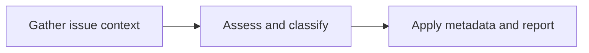

AI issue triage with GitHub Agentic Workflows means running an agent whenever a new issue arrives so it can classify the report, set priority labels, detect likely duplicates, and ask for missing details. The workflow stays read-only during analysis, and gh-aw performs the resulting GitHub writes through safe outputs.

To install this sample, use:

```bash
gh aw add-wizard githubnext/agentics/issue-triage
```

## How it works



The workflow first checks whether the report is complete and searches for related issues. It then sets only well-supported issue types and labels, distinguishes duplicates from related work, assesses whether the issue is ready for a coding agent, and posts a concise triage report or focused clarifying questions.

## Example output

For a short documentation report, Issue Triage applied `documentation` and `needs-info`, explained the classification, and asked focused questions that a maintainer can act on.

<a href="https://github.com/AndressaSiqueira/AgenticRepo/issues/20#issuecomment-5285752121">
    
</a>

## Workflow source

<!-- agentics-workflow: issue-triage.md -->

`add-labels` and `add-comment` matter for security because the agent does not receive direct write access to issues. gh-aw validates label names and comment output before posting, which reduces the risk of prompt injection turning repository analysis into unrestricted writes.

Every label listed under `allowed` must already exist in the target repository. `bug`, `feature`, and `question` ship as GitHub defaults, but labels such as `needs-info`, `priority/p0`, `priority/p1`, and `priority/p2` do not, and applying a missing label fails at runtime. Create them before the first run with `gh label create needs-info` (repeat per label) or from the repository's Settings > Labels page.

Review the first few triage reports and adjust the allowed labels and priority definitions to match the repository's conventions. After editing, run `gh aw compile` and commit both the Markdown workflow and its generated lock file.

## Learn More

- [Run Claude Code in GitHub Actions with gh-aw](/gh-aw/engines/claude/)
- [Run GitHub Copilot agents in GitHub Actions with gh-aw](/gh-aw/engines/copilot/)
- [IssueOps](/gh-aw/patterns/issue-ops/)
- [Quick start](/gh-aw/setup/quick-start/)
