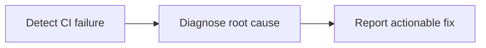

CI failure investigation with GitHub Agentic Workflows means starting an agent after a failed GitHub Actions workflow so it can inspect failed jobs and logs, correlate the failure with repository changes, and produce an actionable diagnosis.

To install this sample, use:

```
gh aw add-wizard githubnext/agentics/ci-doctor
```



## Example output

<a href="https://github.com/github/gh-aw/issues/14295"></a>

In [github/gh-aw#14295](https://github.com/github/gh-aw/issues/14295), CI Doctor traced a failing assertion to nondeterministic Go map iteration. The report identifies the failed job, explains why the output order varied, and recommends sorting and formatting the engine list deterministically. The issue was generated by an Agentics CI Doctor workflow and links back to the workflow run and pinned source version.

## Workflow source

<!-- agentics-workflow: ci-doctor.md -->

The agent has read-only access to Actions and repository content. Issue creation and comments are safe outputs, so gh-aw validates them before publishing.

Change `workflows: ["CI"]` to the workflow names used by the repository, then run `gh aw compile` and commit both the Markdown workflow and its generated lock file.

## Learn More

- [CI Doctor source workflow](https://github.com/githubnext/agentics/blob/main/workflows/ci-doctor.md)
- [Workflow run triggers](/gh-aw/reference/triggers/#workflow-run-triggers-workflow_run)
- [Safe outputs](/gh-aw/reference/safe-outputs/)
- [Debugging workflows](/gh-aw/troubleshooting/debugging/)
