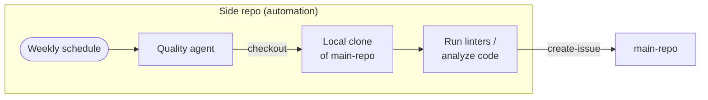

This example shows how to run weekly code quality checks on `my-org/main-repo` from a dedicated side repository. The agent checks out the target repository, runs linters and complexity analysis locally, and creates prioritized issues in the main repo — keeping automation infrastructure entirely separate from the codebase it monitors.

## How It Works



The agent checks out `main-repo` into the workflow runner, runs linters and lightweight complexity/security checks, then creates focused issues in the main repo for significant findings.

## Setup

### 1. Create the Side Repository

```bash
gh repo create my-org/main-repo-quality --private
gh repo clone my-org/main-repo-quality
cd main-repo-quality
```

### 2. Create the Authentication Token

Create a fine-grained PAT (`GH_AW_MAIN_REPO_TOKEN`) scoped **only to `my-org/main-repo`** with these permissions:

| Permission | Level | Purpose |
|------------|-------|---------|
| Contents | Read-only | Checkout the repository |
| Issues | Read & write | Create quality issues |

Store it as a secret in the **side repository**:

```bash
gh secret set GH_AW_MAIN_REPO_TOKEN --repo my-org/main-repo-quality
```

> [!NOTE]
> The default `GITHUB_TOKEN` cannot access other repositories. The explicit token must be set on both `checkout` and `safe-outputs`.

For enhanced security, use a [GitHub App token](/gh-aw/reference/auth/#using-a-github-app-for-authentication) — minted on demand and automatically revoked after each job.

### 3. Create the Workflow

In the side repository, create `.github/workflows/code-quality.md`:

````aw wrap
---
on: weekly on monday

permissions:
  contents: read

checkout:
  repository: my-org/main-repo
  github-token: ${{ secrets.GH_AW_MAIN_REPO_TOKEN }}
  path: repo
  current: true

tools:
  github:
    github-token: ${{ secrets.GH_AW_MAIN_REPO_TOKEN }}
    toolsets: [repos, pull_requests]
  bash:
    - "npx:*"
    - "eslint:*"
    - "pip:*"

safe-outputs:
  github-token: ${{ secrets.GH_AW_MAIN_REPO_TOKEN }}
  create-issue:
    target-repo: "my-org/main-repo"
    title-prefix: "[quality] "
    labels: [code-quality, automation]
    max: 10

---

# Weekly Code Quality Review

The target repository has been checked out to `${{ github.workspace }}/repo`. Start by navigating there:

```
cd ${{ github.workspace }}/repo
```

## What to Analyze

### 1. JavaScript / TypeScript (if package.json exists)

```bash
npx eslint . --format json --max-warnings 0 2>/dev/null | head -200
```

Prioritize files with more than 5 ESLint errors, missing error-handling patterns such as empty `catch` blocks, and repeated unused imports or variables.

### 2. Complexity (any language)

Count lines per file and flag files over 500 lines as candidates for splitting:

```bash
find . -name "*.ts" -o -name "*.js" -o -name "*.py" | xargs wc -l | sort -rn | head -20
```

### 3. Python (if requirements.txt or pyproject.toml exists)

```bash
pip install flake8 --quiet && flake8 . --count --statistics 2>/dev/null | tail -20
```

Flag modules with more than 10 flake8 errors.

### 4. Repository signals

Check open Dependabot alerts on `my-org/main-repo`, then review the last 10 merged PRs for recurring patterns such as skipped tests or files that are repeatedly changed together.

## What to Create

Create **one issue per distinct finding category** rather than one per file. Each issue should name the affected files or modules with GitHub links, explain why the finding matters, suggest a concrete first step, and assign a severity: High for security or crash risks, Medium for maintainability, and Low for style. Skip findings with fewer than 3 instances to avoid noise.

## What to Skip

Do not create issues for style preferences without an established linter rule, files with a `// quality-exempt` comment, or test files such as `*.test.*`, `*.spec.*`, and `__tests__/`.
````

Compile: `gh aw compile`.

## Customizing the Analysis

Use these variations when you need a narrower or broader review.

### Running Type Checkers

Add TypeScript checking to the bash tools and prompt:

```aw wrap
---
tools:
  bash:
    - "npx:*"
    - "tsc:*"
---
# ...
Run `npx tsc --noEmit 2>&1 | head -50` and flag any type errors in non-test files.
```

### Targeting a Specific Directory

Use `path:` in checkout and navigate into a subdirectory:

```aw wrap
---
checkout:
  repository: my-org/monorepo
  github-token: ${{ secrets.GH_AW_MAIN_REPO_TOKEN }}
  path: repo
  current: true
---
# ...
Navigate to `${{ github.workspace }}/repo/packages/api` and run analysis only on that package.
```

### Checking Out Multiple Repositories

Compare quality trends across related repos:

```aw wrap
---
checkout:
  - repository: my-org/service-alpha
    path: alpha
    github-token: ${{ secrets.GH_AW_MAIN_REPO_TOKEN }}
  - repository: my-org/service-beta
    path: beta
    github-token: ${{ secrets.GH_AW_MAIN_REPO_TOKEN }}
    current: true  # Issues created here
---
# ...
Compare complexity metrics between alpha/ and beta/ and create a comparative report issue.
```

## Important: `current: true` and Working Directory

`current: true` tells the agent which repository to treat as the primary target for GitHub operations (issue creation, PR references). It does **not** automatically change the working directory. Always include an explicit `cd` in the prompt:

```
cd ${{ github.workspace }}/repo
```

Without it, the agent starts in `$GITHUB_WORKSPACE` (the side repo) and may analyze the wrong directory.

## Learn More

See [MultiRepoOps](/gh-aw/patterns/multi-repo-ops/) for side-repository topologies, [Triage from Side Repo](/gh-aw/gallery/multi-repo/triage-from-side-repo/) for a related issue-triage workflow, [Cross-Repository Operations](/gh-aw/reference/cross-repository/) for checkout configuration and `current: true`, [Authentication](/gh-aw/reference/auth/) for PAT and GitHub App setup, and [Safe Outputs](/gh-aw/reference/safe-outputs/) for issue creation with `max` and labels.
