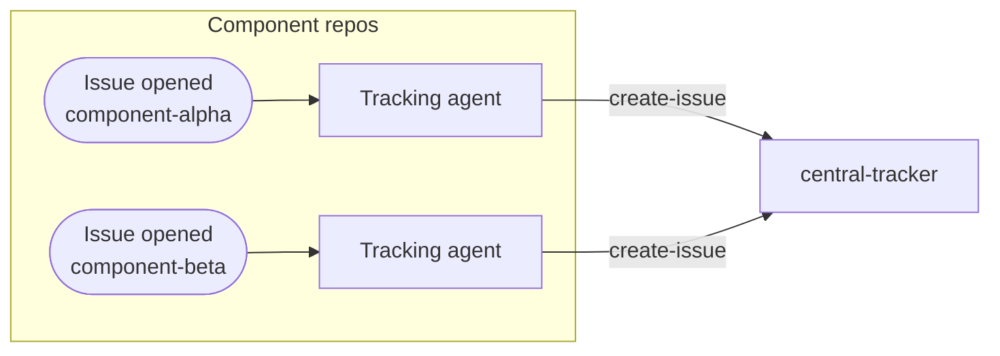
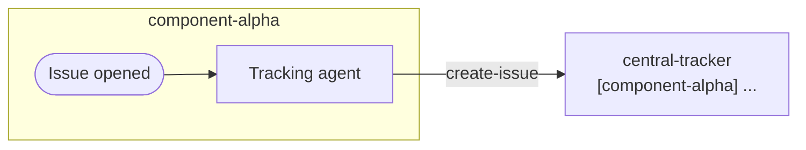
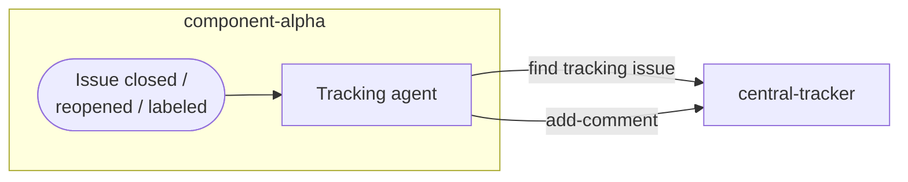
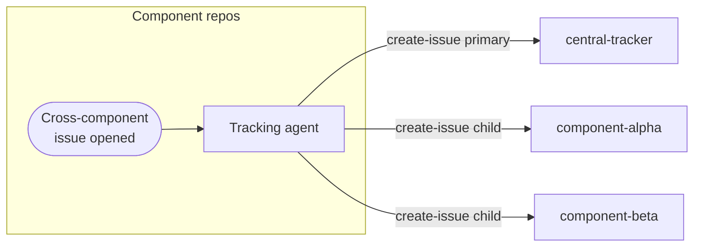
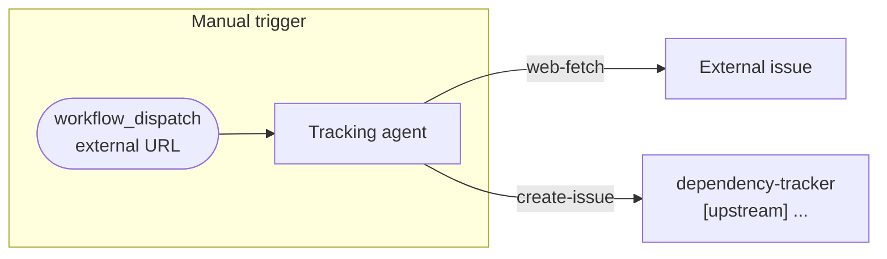
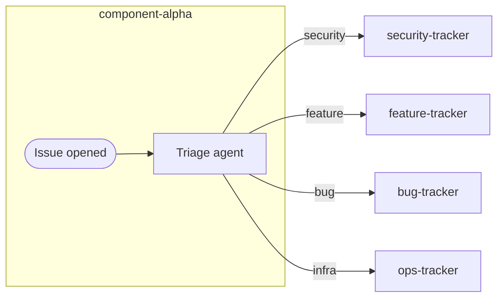
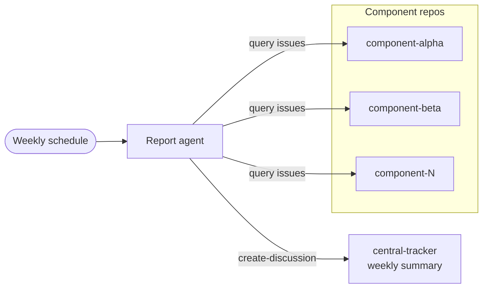
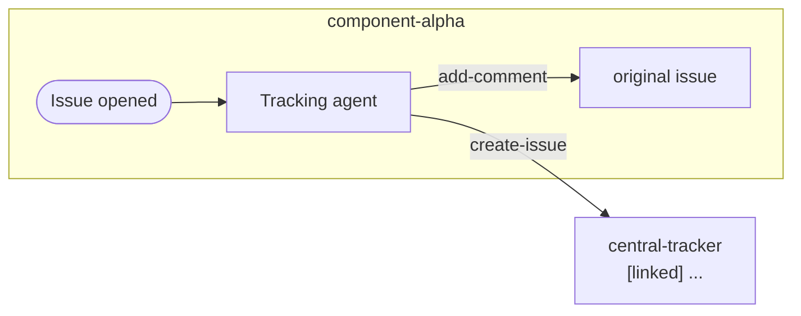
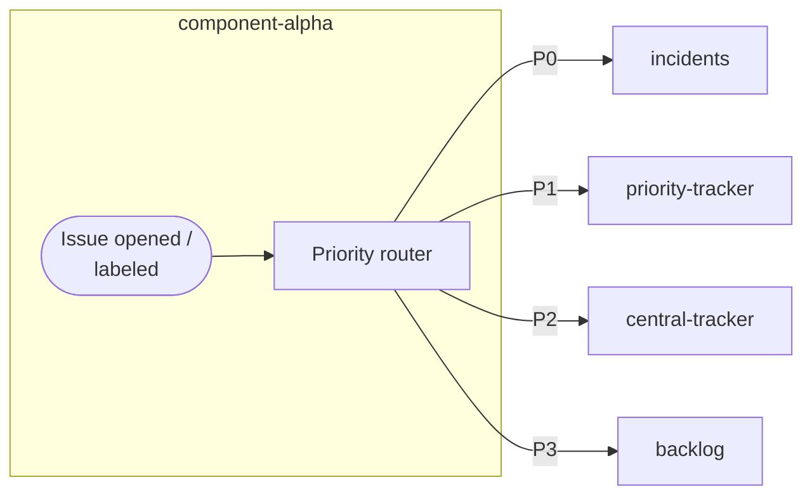

Cross-repository issue tracking enables organizations to maintain a centralized view of work across multiple component repositories. When issues are created in component repos, tracking issues are automatically created in a central repository, providing visibility without requiring direct access to all repositories.

## When to Use

Use cross-repo issue tracking for component-based architectures where multiple teams need centralized visibility, when tracking external dependencies, coordinating cross-project initiatives, or aggregating metrics from distributed repositories.

## How It Works



Workflows in component repositories create tracking issues in a central repository when local issues are opened, updated, or closed. The central repository maintains references to all component issues, enabling organization-wide visibility and reporting.

## Basic Tracking Issue Creation

Create tracking issues in central repository when component issues are opened:



```aw wrap
---
on:
  issues:
    types: [opened]

permissions:
  contents: read
  actions: read

tools:
  github:
    toolsets: [issues]

safe-outputs:
  github-token: ${{ secrets.GH_AW_CROSS_REPO_PAT }}
  create-issue:
    target-repo: "myorg/central-tracker"
    title-prefix: "[component-alpha] "
    labels: [from-component-alpha, tracking-issue]
---

# Create Central Tracking Issue

When an issue is opened in component-alpha, create a corresponding
tracking issue in the central tracker.

**Original issue:** ${{ github.event.issue.html_url }}
**Issue number:** ${{ github.event.issue.number }}
**Content:** "${{ steps.sanitized.outputs.text }}"

Create tracking issue with link to original, component identifier, summary, suggested priority, and labels `from-component-alpha` and `tracking-issue`.
```

## Status Synchronization

Update tracking issues when component issues change status:



```aw wrap
---
on:
  issues:
    types: [closed, reopened, labeled, unlabeled]

permissions:
  contents: read
  actions: read

tools:
  github:
    toolsets: [issues]

safe-outputs:
  github-token: ${{ secrets.GH_AW_CROSS_REPO_PAT }}
  add-comment:
    target-repo: "myorg/central-tracker"
    target: "*"  # Find related tracking issue
---

# Update Central Tracking Issue Status

When this component issue changes status, update the central tracking issue.

**Original issue:** ${{ github.event.issue.html_url }}
**Action:** ${{ github.event.action }}

Search for tracking issue in `myorg/central-tracker` and add comment with status update (✅ resolved, 🔄 reopened, or 🏷️ label changes), issue link, and timestamp.
```

## Multi-Component Tracking

Track issues that span multiple component repositories:



```aw wrap
---
on:
  issues:
    types: [opened]
    # Triggered when issue has 'cross-component' label

permissions:
  contents: read
  actions: read

tools:
  github:
    toolsets: [issues]

safe-outputs:
  github-token: ${{ secrets.GH_AW_CROSS_REPO_PAT }}
  create-issue:
    max: 3  # May create issues in multiple tracking repos
    target-repo: "myorg/central-tracker"
    title-prefix: "[cross-component] "
    labels: [cross-component, needs-coordination]
---

# Track Cross-Component Issues

When an issue is marked as cross-component, create coordinated tracking issues.

**Original issue:** ${{ github.event.issue.html_url }}

Identify affected components, create primary tracking issue in central tracker with affected components list and coordination requirements, and create child issues in component repos if needed. Tag team leads and schedule coordination meeting for high-priority issues.
```

## External Dependency Tracking

Track issues from external/upstream repositories:



```aw wrap
---
on:
  workflow_dispatch:
    inputs:
      external_issue_url:
        description: 'URL of external issue to track'
        required: true
        type: string

permissions:
  contents: read

tools:
  github:
    toolsets: [issues]
  web-fetch:

safe-outputs:
  github-token: ${{ secrets.GH_AW_CROSS_REPO_PAT }}
  create-issue:
    target-repo: "myorg/dependency-tracker"
    title-prefix: "[upstream] "
    labels: [external-dependency, upstream-issue]
---

# Track External Dependency Issue

Create tracking issue for external dependency problem.

**External issue URL:** ${{ github.event.inputs.external_issue_url }}

Fetch external issue details, identify affected internal projects, and create tracking issue with external link, status, impact assessment, affected repositories, and monitoring plan. Set weekly reminder and notify affected teams.
```

## Automated Triage and Routing

Triage component issues and route to appropriate trackers:



```aw wrap
---
on:
  issues:
    types: [opened]

permissions:
  contents: read
  actions: read

tools:
  github:
    toolsets: [issues]

safe-outputs:
  github-token: ${{ secrets.GH_AW_CROSS_REPO_PAT }}
  create-issue:
    max: 2
    title-prefix: "[auto-triaged] "
---

# Triage and Route to Tracking Repos

Analyze new issues and create tracking issues in appropriate repositories.

**Original issue:** ${{ github.event.issue.html_url }}
**Content:** "${{ steps.sanitized.outputs.text }}"

Analyze issue severity and route to appropriate tracker: security issues to `myorg/security-tracker`, features to `myorg/feature-tracker`, bugs to `myorg/bug-tracker`, or infrastructure to `myorg/ops-tracker`. Include original link, triage reasoning, priority, affected components, and SLA targets.
```

## Aggregated Reporting

Create weekly summary of tracked issues:



```aw wrap
---
on: weekly on monday

permissions:
  contents: read

tools:
  github:
    toolsets: [issues]

safe-outputs:
  github-token: ${{ secrets.GH_AW_CROSS_REPO_PAT }}
  create-discussion:
    target-repo: "myorg/central-tracker"
    category: "Status Reports"
    title-prefix: "[weekly] "
---

# Weekly Cross-Repo Issue Summary

Generate weekly summary of tracked issues across all component repositories.

Summarize issues from all component repositories including open counts by priority, issues opened/closed this week, stale issues (>30 days), and blockers. Create discussion with executive summary, per-repo breakdown, trending analysis, and action items formatted as markdown table.
```

## Bidirectional Linking

Maintain references between component and tracking issues:



```aw wrap
---
on:
  issues:
    types: [opened]

permissions:
  contents: read
  actions: read

tools:
  github:
    toolsets: [issues]

safe-outputs:
  github-token: ${{ secrets.GH_AW_CROSS_REPO_PAT }}
  create-issue:
    target-repo: "myorg/central-tracker"
    title-prefix: "[linked] "
  add-comment:
    max: 1
---

# Create Tracking Issue with Bidirectional Links

Create tracking issue and add comment to original with link.

**Original issue:** ${{ github.event.issue.html_url }}

Create tracking issue in `myorg/central-tracker` with title "[linked] ${{ github.event.issue.title }}" and body linking to original. Add comment to original issue with tracking link. This enables easy navigation, automatic GitHub reference detection, and clear audit trail.
```

## Priority-Based Routing

Route issues to different trackers based on priority:



```aw wrap
---
on:
  issues:
    types: [opened, labeled]

permissions:
  contents: read
  actions: read

tools:
  github:
    toolsets: [issues]

safe-outputs:
  github-token: ${{ secrets.GH_AW_CROSS_REPO_PAT }}
  create-issue:
    max: 1
    title-prefix: "[priority-routed] "
---

# Route Issues Based on Priority

Route issues to appropriate tracking repository based on priority level.

**Original issue:** ${{ github.event.issue.html_url }}
**Labels:** Check for priority labels (P0, P1, P2, P3)

Route by priority: P0 → `myorg/incidents`, P1 → `myorg/priority-tracker`, P2 → `myorg/central-tracker`, P3 → `myorg/backlog`. Include original link, priority, SLA expectations, and escalation path. For P0, alert on-call team and include incident response checklist.
```

## Authentication Setup

Cross-repo issue tracking requires appropriate authentication:

### PAT Configuration

```bash
# Create PAT with issues and repository read permissions
gh aw secrets set GH_AW_CROSS_REPO_PAT --value "ghp_your_token_here"
```

**Required Permissions:**
- `repo` (for private repositories)
- `public_repo` (for public repositories)

### GitHub App Configuration

For enhanced security, use GitHub App installation tokens. See [Using a GitHub App for Authentication](/gh-aw/reference/auth/#using-a-github-app-for-authentication) for complete configuration including repository scoping options.

## Learn More

- [MultiRepoOps Design Pattern](/gh-aw/patterns/multi-repo-ops/) - Complete multi-repo overview
- [Feature Synchronization](/gh-aw/gallery/multi-repo/feature-sync/) - Code sync patterns
- [Safe Outputs Reference](/gh-aw/reference/safe-outputs/) - Issue creation configuration
- [GitHub Tools](/gh-aw/reference/github-tools/) - API access configuration
