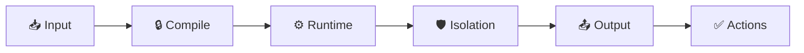

GitHub Agentic Workflows compiles Markdown workflow files into [GitHub Actions](https://docs.github.com/en/actions) workflows that run AI agents for complex, multi-step repository tasks. GitHub Actions supplies the triggers, runners, logs, and job orchestration; `gh-aw` adds the AI engine, natural-language instructions, and security controls for agent execution.

## Workflow Structure

Each workflow contains [frontmatter](/gh-aw/reference/glossary/#frontmatter) (the YAML configuration section between `---` markers) and markdown instructions. The frontmatter defines [triggers](/gh-aw/reference/triggers/) (when the workflow runs), [permissions](/gh-aw/reference/permissions/) (what it can access), and [tools](/gh-aw/reference/tools/) (what capabilities the AI has), while the markdown contains natural language task descriptions. This declarative structure enables reliable, secure agentic programming by sandboxing AI capabilities and triggering at the right moments.

```aw wrap
---
on: ...
permissions: ...
tools: ...
---
# Natural Language Instructions
Analyze this issue and provide helpful triage comments...
```

## AI Engines

Built-in engines are **GitHub Copilot** (default), **Claude Code**, **OpenAI Codex**, **Google Gemini**, and **Pi**. Each [AI engine](/gh-aw/reference/engines/) runs the selected model and interprets the natural-language instructions using the configured tools and permissions.

Each engine authenticates with its own secret or permission:

| Engine | Frontmatter `engine:` | Secret or permission required |
|---|---|---|
| [GitHub Copilot](/gh-aw/engines/copilot/) (default) | `copilot` | [`copilot-requests: write`](/gh-aw/reference/auth/#copilot-requests-write-permission) or [`COPILOT_GITHUB_TOKEN`](/gh-aw/reference/auth/#copilot_github_token) |
| [Claude Code](/gh-aw/engines/claude/) | `claude` | [`ANTHROPIC_API_KEY`](/gh-aw/reference/auth/#anthropic_api_key) or [Anthropic WIF](/gh-aw/reference/auth/#anthropic-workload-identity-federation-wif) |
| [OpenAI Codex](/gh-aw/engines/codex/) | `codex` | `CODEX_API_KEY` or [`OPENAI_API_KEY`](/gh-aw/reference/auth/#openai_api_key) |
| [Google Gemini](/gh-aw/engines/gemini/) | `gemini` | [`GEMINI_API_KEY`](/gh-aw/reference/auth/#gemini_api_key) or [Google WIF](/gh-aw/reference/auth/#google-workload-identity-federation-wif) |
| [Pi](/gh-aw/engines/pi/) | `pi` | Copilot, Anthropic, or OpenAI/Codex authentication |

See [Authentication](/gh-aw/reference/auth/) for the full setup instructions for each engine.

## Tools and Model Context Protocol (MCP)

Workflows expose only configured [tools](/gh-aw/reference/tools/) to the AI agent. Some integrations use the **[Model Context Protocol](/gh-aw/reference/glossary/#mcp-model-context-protocol)** (MCP), a standardized protocol for connecting AI agents to external tools and services; other tools are provided by the selected AI engine or built-in `gh-aw` adapters.

## GitHub Agentic Workflows and standard GitHub Actions

Standard GitHub Actions workflows are ideal for deterministic operations such as builds, tests, linting, deployments, and reproducible scripts. Keep these operations deterministic when identical inputs should produce predictable steps and outputs.

**[Agentic workflows](/gh-aw/reference/glossary/#agentic)** add AI reasoning for tasks such as investigation, triage, review, research, and content or code generation. They run on GitHub Actions and can include deterministic steps, so GitHub Agentic Workflows complements existing CI/CD instead of replacing it.

## Security Design

GitHub Agentic Workflows uses a defense-in-depth security architecture to reduce risk from prompt injection, rogue MCP servers, and compromised agents. The supported agent-job path defaults to compilation-time validation, runtime isolation, permission separation, network controls, and output sanitization. Some controls can be changed or disabled and must be evaluated during workflow review.



Supported agent jobs run with minimal permissions and no write access by default. Configured safe outputs are processed in separate jobs before changes are applied, and critical actions can require human approval. Custom jobs and explicitly relaxed controls form separate trust boundaries. For details and exceptions, see the [GitHub Agentic Workflows security architecture](/gh-aw/introduction/architecture/).

## Best Practices

Start simple and iterate with clear, specific instructions. Test workflows using `gh aw compile --watch` and `gh aw run`, monitor costs with `gh aw logs`, and review AI-generated content before merging. Use [`safe outputs`](/gh-aw/reference/safe-outputs/) (pre-approved GitHub operations) for controlled creation of issues, comments, and PRs.

## Learn More

- Follow the [GitHub Agentic Workflows quickstart](/gh-aw/setup/quick-start/).
- Learn how to [create an agentic workflow](/gh-aw/setup/creating-workflows/).
- Compare [supported AI engines and authentication](/gh-aw/reference/engines/).
- Browse the [GitHub Agentic Workflows gallery](/gh-aw/gallery/).
- Read the [security architecture](/gh-aw/introduction/architecture/) and [FAQ](/gh-aw/reference/faq/).
- Practice with the [gh-aw workshop](https://github.com/githubnext/gh-aw-workshop).
