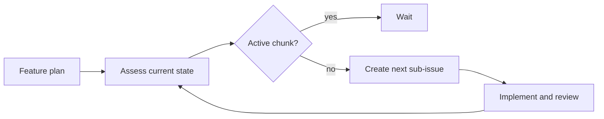

Feature Grower is a pattern for advancing a long-lived feature in small,
reviewable increments. A scheduled agent reads the feature plan, assesses the
current implementation, and creates only the next useful chunk of work. The
next run reassesses the feature after that chunk has been completed.

This avoids waterfall planning, where a large task tree is created before the
implementation has produced feedback. The plan states the direction; repository
files, completed work, and optional memory show the current position.



## The crop and cookie model

The included
[`feature-grower`](https://github.com/github/gh-aw/blob/main/.github/workflows/feature-grower.md)
workflow uses two labels:

- A `crop` labels an open parent issue containing the feature plan.
- A `cookie` labels an implementation-ready child issue sized for one pull
  request.

Each scheduled run scans open crops. A crop with an open cookie child is left
alone. The agent reviews the oldest eligible crop's plan, closed children,
current repository files, and advisory memory before creating one new cookie as
a native sub-issue. The next run is skipped while that cookie remains open.

The open-child gate provides backpressure. It prevents the planner from
producing work faster than implementation can validate its assumptions and
keeps each crop focused on one active increment.

## Assessment sources

Use the feature issue as the durable statement of intent and repository files
as the source of truth for implementation status. Closed children and merged
pull requests provide a history of completed increments. Cache or repository
memory can preserve brief observations between runs, but stale memory must not
override current code or issue state.

The next chunk should be the smallest coherent change that materially advances
the feature. It needs a clear objective, relevant implementation context,
explicit non-goals, and testable acceptance criteria. Do not decompose the
entire remaining plan unless the current increment requires that analysis.

## Workflow shape

```aw wrap title=".github/workflows/feature-grower.md"
---
on:
  schedule: daily on weekdays
  workflow_dispatch:
  skip-if-match: 'is:issue is:open "gh-aw-workflow-id: feature-grower" in:body'

permissions:
  contents: read
  issues: read

tools:
  cache-memory:
    key: feature-grower
  github:
    mode: gh-proxy
    toolsets: [issues, repos]

safe-outputs:
  create-issue:
    labels: [cookie]
    max: 1

concurrency:
  group: feature-grower
  cancel-in-progress: false
---

Find open issues labeled `crop`. Skip every crop that has an open child issue
labeled `cookie`. For each eligible crop, assess the plan against completed
children, memory, and current repository files. Create one implementation-ready
`cookie` issue with its `parent` set to the crop issue number. Use `noop` when
there is no useful next increment.
```

Prefetching crops and their native sub-issue relationships in a deterministic
step makes the gate auditable and reduces agent tool calls. Recheck the gate
immediately before declaring the safe output to reduce duplicate work caused by
concurrent human activity.

Do not use `create-issue.group: true`: grouping creates a workflow-owned parent
instead of attaching the new issue to the existing crop.

## Scheduling and backpressure

Always configure `skip-if-match` so an older output from the workflow blocks a
new one while it remains open. Match the stable workflow marker rather than a
title that a user can edit. Issue-producing workflows use `is:issue is:open`;
pull-request-producing variants use `is:pr is:open`, and draft pull requests
also count as open.

Choose the cadence based on how quickly maintainers consume each increment:

- Use the [All You Can Eat pattern](https://github.com/github/gh-aw/blob/main/.github/aw/workflow-patterns.md#all-you-can-eat-pattern)
  with a frequent schedule, typically every 30 minutes, when the next chunk
  should appear soon after the previous issue closes or pull request merges.
- Use a daily or weekday schedule when slower growth is preferable and a delay
  before the next chunk is acceptable.

In either case, cap creation at one output per run and keep concurrency enabled.

## When to use this pattern

Use Feature Grower when a feature has a stable direction but the best next step
depends on implementation feedback. It works well for migrations, broad
refactors, and capabilities that should land through a series of independently
reviewable pull requests.

Prefer upfront planning when work has fixed dependencies that must be approved
as a whole. Prefer [WorkQueueOps](/gh-aw/patterns/workqueue-ops/) when all work
items are already known, or
[ResearchPlanAssignOps](/gh-aw/patterns/research-plan-assign-ops/) when research
should produce a complete, human-approved task breakdown before implementation.
