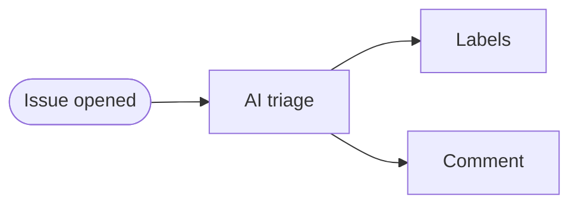

IssueOps turns GitHub issues into automation triggers for triage, routing, responses, and quality checks. In GitHub Agentic Workflows, [issue triggers](/gh-aw/reference/triggers/) start the workflow and [safe-outputs](/gh-aw/reference/safe-outputs/) post automated responses without giving the main AI job write access.

## Example: Issue Triage Assistant

This workflow responds to new issues with contextual guidance by analyzing the title and description for missing bug details, feature requests to categorize, questions to answer, or potential duplicates. It then comments with next steps or immediate help.



Example workflow:

```aw wrap title=".github/workflows/issue-triage.md"
---
on:
  issues:
    types: [opened]

permissions:
  contents: read
  actions: read

safe-outputs:
  add-comment:
    max: 2
---

# Issue Triage Assistant

Analyze new issue content and provide helpful guidance. Examine the title and description for bug reports needing information, feature requests to categorize, questions to answer, or potential duplicates. Respond with a comment guiding next steps or providing immediate assistance.
```

This creates an automated triage flow for new issues.

## Organizing Work with Sub-Issues

Break large work into agent-ready tasks using parent-child issue hierarchies. Create hierarchies with the `parent` field and temporary IDs, or link existing issues with `link-sub-issue`:

```aw wrap
---
on:
  command:
    name: plan

safe-outputs:
  create-issue:
    title-prefix: "[task] "
    max: 6
---

# Planning Assistant

Create a parent tracking issue, then sub-issues linked via parent field:

{"type": "create_issue", "temporary_id": "aw_abc123", "title": "Feature X", "body": "Tracking issue"}
{"type": "create_issue", "parent": "aw_abc123", "title": "Task 1", "body": "First task"}
```

## Learn More

See related patterns and references for interactive commands, label-driven flows, queue processing, secure write operations, GitHub tools, and race-condition control: [ChatOps](/gh-aw/patterns/chat-ops/), [LabelOps](/gh-aw/patterns/label-ops/), [WorkQueueOps](/gh-aw/patterns/workqueue-ops/), [Safe Outputs](/gh-aw/reference/safe-outputs/), [GitHub Tools](/gh-aw/reference/github-tools/), and [Concurrency](/gh-aw/reference/concurrency/).

