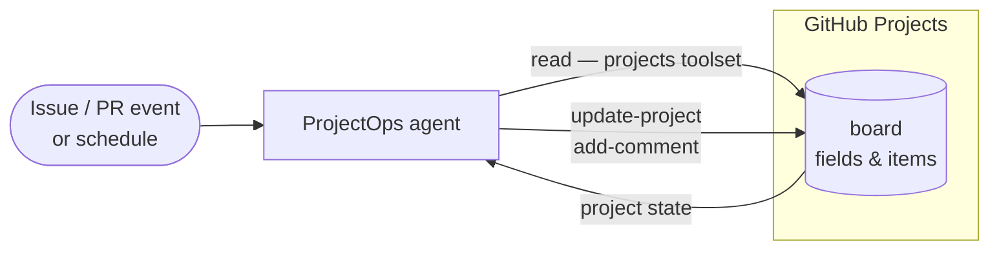

ProjectOps helps teams run project operations with less manual upkeep.

It builds on [GitHub Projects](https://docs.github.com/en/issues/planning-and-tracking-with-projects/learning-about-projects/about-projects), which provides the core planning and tracking layer for issues and pull requests, and adds support for judgment-heavy decisions.

ProjectOps reads project state with GitHub tools and applies changes through [safe-outputs](/gh-aw/reference/safe-outputs/).
It is most useful when you need context-aware routing and field updates. For simple, rule-based transitions, [built-in automations](https://docs.github.com/en/issues/planning-and-tracking-with-projects/automating-your-project/using-the-built-in-automations) are usually enough.

In practice, this gives teams faster triage decisions, cleaner board state, stronger planning signals across related issues and pull requests, and more decision-ready status updates.

## How it works



A practical way to adopt ProjectOps is to start with read-only MCP/GitHub analysis, then gradually add targeted write operations as workflow confidence and policy maturity increase.

ProjectOps combines two capability layers:
- **GitHub tools (`tools.github` + `projects` toolset)** for reading and analyzing project state.
- **Safe outputs** for controlled write operations, including:
  - **[`update-project`](/gh-aw/reference/safe-outputs/#project-board-updates-update-project)** — use when you want to add issues/PRs to a project or update fields (status, priority, owner, dates, custom values).
  - **[`create-project-status-update`](/gh-aw/reference/safe-outputs/#project-status-updates-create-project-status-update)** — use when you want a stakeholder-facing summary in the project Updates tab (weekly health, blockers, risks, next decisions).
  - **[`create-project`](/gh-aw/reference/safe-outputs/#project-creation-create-project)** — use when automation needs to bootstrap a new board for an initiative or team.
  - **[`add-comment`](/gh-aw/reference/safe-outputs/#comment-creation-add-comment)** — use when you want to explain routing decisions or request missing info on the triggering issue/PR.

## Prerequisites

1. **A Project board** and copy the project URL. See [Creating a project](https://docs.github.com/en/issues/planning-and-tracking-with-projects/creating-projects/creating-a-project#creating-a-project).
2. **A Project token** (PAT or GitHub App token). See [Authentication (Projects)](/gh-aw/reference/auth-projects/).
3. **A field contract** (for example: Status, Priority, Team, Iteration, Target Date). See [Understanding fields](https://docs.github.com/en/issues/planning-and-tracking-with-projects/understanding-fields).

## Project Token Authentication

The default `GITHUB_TOKEN` is repository-scoped and cannot access the Projects API. See [Authentication (Projects)](/gh-aw/reference/auth-projects/) for PAT, GitHub App, and secret layout instructions.

## Examples

Let's look at examples of these in action, starting with the [Project Board Summarizer](#project-board-summarizer) (read-only analysis), then moving to controlled write operations with the [Project Board Maintainer](#project-board-maintainer) example.

### Project Board Summarizer

Let's start with a simple agentic workflow that reviews project board state and generates a summary without applying any changes.

```aw wrap
---
on:
  schedule: weekly on monday

permissions:
  contents: read
  actions: read

tools:
  github:
    github-token: ${{ secrets.GH_AW_READ_PROJECT_TOKEN }}
    toolsets: [default, projects]
---

# Project Board Summarizer

Review [project 1](https://github.com/orgs/my-mona-org/projects/1).

Return only:

- New this week
- Blocked + why
- Stale/inconsistent fields
- Top 3 human actions

Read-only. Do not update the project.
```

Our project board might look like this:

<picture>
  <source media="(prefers-color-scheme: dark)" srcSet="/gh-aw/images/projectops-read-board_dark.png" />
  
</picture>

Running the agentic workflow generates a concise summary of project status. We can find this in the GitHub Actions agent run output:
<picture>
  <source media="(prefers-color-scheme: dark)" srcSet="/gh-aw/images/projectops-read-summary_dark.png" />
  
</picture>

### Project Board Maintainer

Let's write an agentic workflow that applies changes to a project board based on issue content and context.
This workflow will run on new issues, analyze the issue and project state, and decide whether to add the issue to the project board and how to set key fields.

```aw wrap
---
on:
  issues:
    types: [opened]

permissions:
  contents: read
  actions: read

tools:
  github:
    github-token: ${{ secrets.GH_AW_READ_PROJECT_TOKEN }}
    toolsets: [default, projects]

safe-outputs:
  update-project:
    github-token: ${{ secrets.GH_AW_WRITE_PROJECT_TOKEN }}
    project: https://github.com/orgs/my-mona-org/projects/1
    max: 1
  add-comment:
    max: 1
---

# Intelligent Issue Triage

Analyze each new issue in this repository and decide whether it belongs on the project board.

Set structured fields only from allowed values:
- Status: Needs Triage | Proposed | In Progress | Blocked
- Priority: Low | Medium | High
- Team: Platform | Docs | Product

Post a short comment on the issue explaining your routing decision and any uncertainty.
```

Once this workflow is compiled and running, it will automatically triage new issues with controlled write operations to the project board and issue comments.

Let's create a new issue to see this in action:

<picture>
  <source media="(prefers-color-scheme: dark)" srcSet="/gh-aw/images/projectops-write-issue_dark.png" />
  
</picture>

The Project Board Maintainer analyzes the issue content and context, then decides to add it to the project board with specific field values (for example, Status: Proposed, Priority: Medium, Team: Docs).
It also posts a comment on the issue explaining the decision and any uncertainty.

<picture>
  <source media="(prefers-color-scheme: dark)" srcSet="/gh-aw/images/projectops-write-board_dark.png" />
  
</picture>

## Best practices

In production, keep the loop simple: issue arrives, agent classifies and proposes/sets fields, safe outputs apply allowed writes, and humans review high-impact changes and exceptions.

- **Auto-apply** low-risk hygiene (add item, set initial status/team).
- **Suggest-only** commitments (priority/date/iteration changes).
- **Always gate** cross-team or cross-repo impact.
- Use `max` caps, allowlists, and explicit approvals to control writes.
- Keep single-select values exact to avoid field drift.
- If you only need simple event-based transitions, prefer [built-in GitHub Project workflows](https://docs.github.com/en/issues/planning-and-tracking-with-projects/automating-your-project/using-the-built-in-automations).

## Learn More

- [IssueOps](/gh-aw/patterns/issue-ops/) — Event-driven issue automation
- [Safe Outputs](/gh-aw/reference/safe-outputs/) — Secure write operations
- [GitHub Tools](/gh-aw/reference/github-tools/) — GitHub API toolsets for reading project state
- [Monitoring with Projects](/gh-aw/experimental/monitoring-with-projects/) — Durable tracking with Projects
- [Authentication (Projects)](/gh-aw/reference/auth-projects/) — PAT and GitHub App setup for Projects
