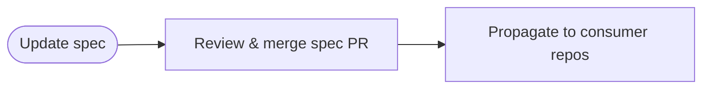

SpecOps is a pattern for maintaining formal specifications using agentic workflows. It leverages the [`w3c-specification-writer` agent](https://github.com/github/gh-aw/blob/main/.github/agents/w3c-specification-writer.agent.md) to create W3C-style specifications with RFC 2119 keywords (MUST, SHALL, SHOULD, MAY) and automatically propagates changes to consuming implementations via [cross-repository workflows](/gh-aw/reference/cross-repository/).



## How SpecOps Works

SpecOps keeps a specification and its implementations aligned: update the spec, review and merge the change, propagate the new requirements to consuming repositories, then refresh compliance tests against the updated version.

## Update Specifications

Create a workflow that uses [`w3c-specification-writer`](https://github.com/github/gh-aw/blob/main/.github/agents/w3c-specification-writer.agent.md) to edit the spec, apply RFC 2119 language, update the version and change log, and open a pull request:

```yaml
---
name: Update MCP Gateway Spec
on:
  workflow_dispatch:
    inputs:
      change_description:
        description: 'What needs to change in the spec?'
        required: true
        type: string

safe-outputs:
  create-pull-request:
    title-prefix: "[spec] "
    labels: [documentation, specification]

tools:
  edit:
  bash:
---

# Specification Update Workflow

Update the MCP Gateway specification using the w3c-specification-writer agent.

**Change Request**: ${{ inputs.change_description }}

## Your Task

1. Review the current specification at `docs/src/content/docs/reference/mcp-gateway.md`

2. Apply the requested changes following W3C conventions:
   - Use RFC 2119 keywords (MUST, SHALL, SHOULD, MAY)
   - Update version number (major/minor/patch)
   - Add entry to Change Log section
   - Update Status of This Document if needed

3. Ensure changes maintain clear conformance requirements, testable specifications, and complete examples

4. Create a pull request with the updated specification
```

## Propagate Changes

After the specification PR merges, trigger a follow-up workflow to update consuming repositories and verify compliance:

```yaml
---
name: Propagate Spec Changes
on:
  push:
    branches:
      - main
    paths:
      - 'docs/src/content/docs/reference/mcp-gateway.md'

engine: copilot
strict: true

safe-outputs:
  create-pull-request:
    title-prefix: "[spec-update] "
    labels: [dependencies, specification]

tools:
  github:
    toolsets: [repos, pull_requests]
  edit:
  bash:
---

# Specification Propagation Workflow

The MCP Gateway specification has been updated. Propagate changes to consuming repositories.

## Consuming Repositories

Update `gh-aw-mcpg` for implementation compliance, schemas, and tests, and update `gh-aw` for MCP gateway validation and documentation.

## Your Task

1. Read the latest specification version and change log.
2. Identify breaking changes and new requirements.
3. Update each consuming repository to match the spec, run tests, and create a pull request.
4. Create a tracking issue that links the resulting PRs.
```

## Specification Structure

W3C-style specifications should include an Abstract, Status, Introduction, Conformance, numbered technical sections that use RFC 2119 keywords, compliance testing, references, and a change log.

**Example RFC 2119 usage**:

```markdown
## 3. Gateway Configuration

The gateway MUST validate all configuration fields before startup.
The gateway SHOULD log validation errors with field names.
The gateway MAY cache validated configurations.
```

See the [`w3c-specification-writer` agent](https://github.com/github/gh-aw/blob/main/.github/agents/w3c-specification-writer.agent.md) for a complete template and guidelines.

## Semantic Versioning

| Bump | When |
|------|------|
| **Major (X.0.0)** | Breaking changes |
| **Minor (0.Y.0)** | New features, backward-compatible |
| **Patch (0.0.Z)** | Bug fixes, clarifications |

The [MCP Gateway Specification](/gh-aw/reference/mcp-gateway/) is a live example — maintained by the `layout-spec-maintainer` workflow and implemented in [gh-aw-mcpg](https://github.com/github/gh-aw-mcpg).

## Learn More

See [MultiRepoOps](/gh-aw/patterns/multi-repo-ops/) for cross-repository coordination, [Cross-Repository Operations](/gh-aw/reference/cross-repository/) for checkout and target-repo configuration, and [Safe Outputs](/gh-aw/reference/safe-outputs/) for secure write operations.
