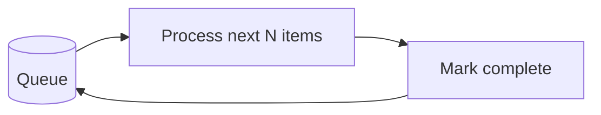
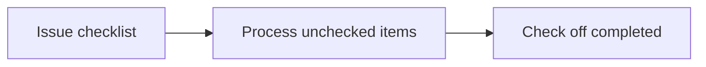
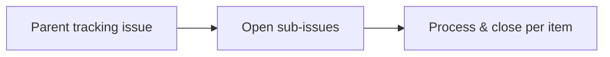
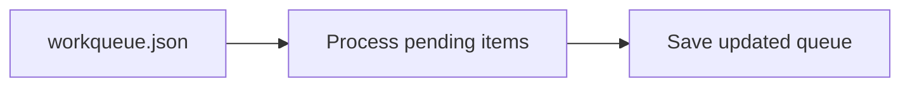
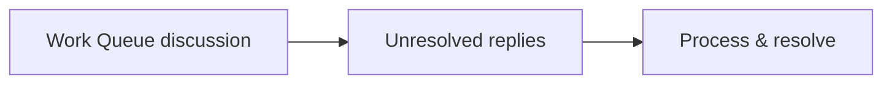

WorkQueueOps is a pattern for systematically processing a large backlog of work items. Instead of processing everything at once, work is queued using issue checklists, [cache-memory](/gh-aw/reference/cache-memory/), or Discussions as durable backends, tracked, and consumed incrementally — surviving interruptions, rate limits, and multi-day horizons. Use it when operations are idempotent and progress visibility matters.



## Queue Strategy 1: Issue Checklist as Queue

Use GitHub issue checkboxes as a lightweight, human-readable queue. The agent reads the issue body, finds unchecked items, processes each one, and checks it off. Best for small-to-medium batches (< 100 items). Use [Concurrency](/gh-aw/reference/concurrency/) controls to prevent race conditions between parallel runs.

```aw wrap
---
on:
  workflow_dispatch:
    inputs:
      queue_issue:
        description: "Issue number containing the checklist queue"
        required: true

tools:
  github:
    toolsets: [issues]

safe-outputs:
  update-issue:
    body: true
  add-comment:
    max: 1

concurrency:
  group: workqueue-${{ inputs.queue_issue }}
  cancel-in-progress: false
---

# Checklist Queue Processor

You are processing a work queue stored as checkboxes in issue #${{ inputs.queue_issue }}.

1. Read issue #${{ inputs.queue_issue }} and find all unchecked items (`- [ ]`).
2. For each unchecked item (at most 10 per run): perform the required work, then edit the issue body to change `- [ ]` to `- [x]`.
3. Add a comment summarizing what was completed and what remains.
4. If all items are checked, close the issue with a summary comment.
```



## Queue Strategy 2: Sub-Issues as Queue

Create one sub-issue per work item. The agent queries open sub-issues of a parent tracking issue, processes each one, and closes it when done. Scales to hundreds of items with individual discussion threads per item. Use `max:` limits on `close-issue` to avoid notification storms.

```aw wrap
---
on:
  schedule: hourly
  workflow_dispatch:

tools:
  github:
    toolsets: [issues]

safe-outputs:
  add-comment:
    max: 5
  close-issue:
    max: 5

concurrency:
  group: sub-issue-queue
  cancel-in-progress: false
---

# Sub-Issue Queue Processor

You are processing a queue of open sub-issues. The parent tracking issue is labeled `queue-tracking`.

1. Find the open issue labeled `queue-tracking` — this is the queue parent.
2. List its open sub-issues and process at most 5 per run.
3. For each sub-issue: read the body, perform the work, add a result comment, then close the issue.
4. Add a progress comment on the parent issue showing how many items remain.

If no sub-issues are open, post a comment on the parent issue saying the queue is empty.
```



## Queue Strategy 3: Cache-Memory Queue

Store queue state as a JSON file in [cache-memory](/gh-aw/reference/cache-memory/). Each run loads the file, picks up where the last run left off, and saves the updated state. Best for large queues and multi-day processing horizons where items are generated programmatically. Cache-memory is scoped to a single branch; use filesystem-safe timestamps in filenames (no colons — e.g., `YYYY-MM-DD-HH-MM-SS-sss`).

```aw wrap
---
on:
  schedule: daily on weekdays
  workflow_dispatch:

tools:
  cache-memory: true
  github:
    toolsets: [repos, issues]
  bash:
    - "jq"

safe-outputs:
  add-comment:
    max: 10
  add-labels:
    allowed: [processed, needs-review]
    max: 10
---

# Cache-Memory Queue Processor

You process items from a persistent JSON queue at `/tmp/gh-aw/cache-memory/workqueue.json`:

```json
{
  "pending": ["item-1", "item-2"],
  "in_progress": [],
  "completed": ["item-0"],
  "failed": [],
  "last_run": "2026-04-07-06-00-00"
}
```

1. Load the queue file. If it doesn't exist, initialize it by listing all open issues without the label `processed` and populating `pending` with their numbers.
2. Move up to 10 items from `pending` to `in_progress`.
3. For each item: perform the required operation, then move it to `completed` on success or `failed` (with an error note) on failure.
4. Save the updated queue JSON and report: X completed, Y failed, Z remaining.

If `pending` is empty, announce that the queue is exhausted.
```



## Queue Strategy 4: Discussion-Based Queue

Use a GitHub Discussion to track pending work items. Unresolved replies represent pending work; processing an item means resolving its reply. Best for community-sourced queues and async collaboration where humans need to inspect items before or after processing. Requires `discussions` in the GitHub toolset.

```aw wrap
---
on:
  schedule: daily
  workflow_dispatch:

tools:
  github:
    toolsets: [discussions]

safe-outputs:
  add-comment:
    max: 5
  create-discussion:
    title-prefix: "[queue-log] "
    category: "General"

concurrency:
  group: discussion-queue
  cancel-in-progress: false
---

# Discussion Queue Processor

A GitHub Discussion titled "Work Queue" (category "General") tracks pending items.
Each unresolved top-level reply is a work item.

1. Find the "Work Queue" discussion and list all unresolved replies (`isAnswered: false`).
2. For each unresolved reply (at most 5 per run): parse the work description, perform the work, then reply with the result.
3. Create a summary discussion post documenting what was processed today.
```



## Idempotency and Concurrency

All WorkQueueOps patterns should be **idempotent**: running the same item twice should not cause double processing.

| Technique | How |
|-----------|-----|
| Check before acting | Query current state (label present? comment exists?) before making changes |
| Atomic state updates | Write queue state in a single step; avoid partial updates |
| Concurrency groups | Use `concurrency.group` with `cancel-in-progress: false` to prevent parallel runs |
| Retry budgets | Track failed items separately; set a retry limit before giving up |

## Learn More

- [BatchOps](/gh-aw/patterns/batch-ops/) — Process large volumes in parallel chunks rather than sequentially
- [ResearchPlanAssignOps](/gh-aw/patterns/research-plan-assign-ops/) — Research → Plan → Assign pattern for developer-supervised work
- [Cache Memory](/gh-aw/reference/cache-memory/) — Persistent state storage across workflow runs
- [Repo Memory](/gh-aw/reference/repo-memory/) — Git-committed persistent state for cross-branch sharing
- [Concurrency](/gh-aw/reference/concurrency/) — Prevent race conditions in queue-based workflows
